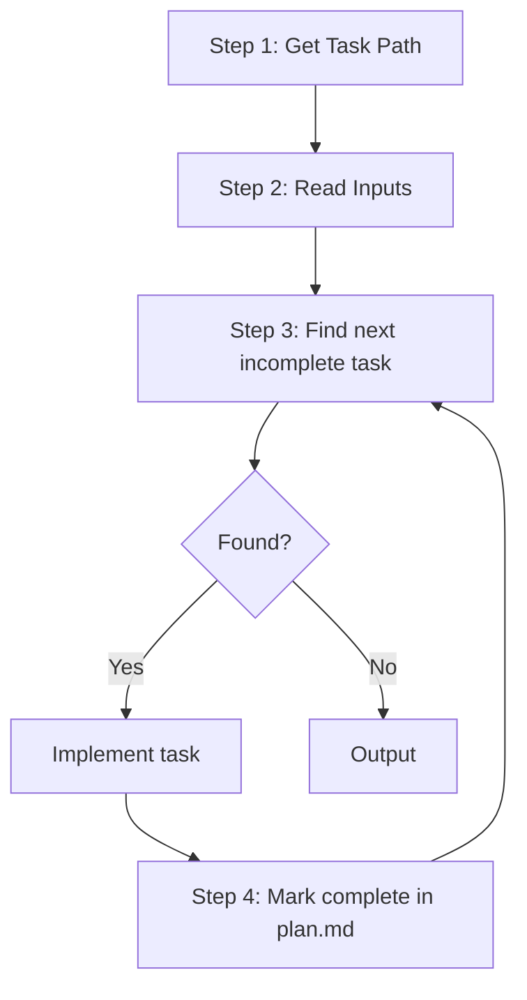

Execute planned tasks into working, high-quality code.

## Core Principle

This phase is **execution and building only**. Do not redesign or replan — translate existing tasks into minimal, correct implementation.

---

## Implementation Principles

### DRY (Don't Repeat Yourself)

- Reuse existing functions, types, and utilities
- Extract shared logic instead of copy-pasting
- Follow patterns already in the codebase

### KISS (Keep It Simple)

- Prefer straightforward solutions over clever ones
- Avoid premature abstraction
- Keep functions small and focused (≤ 30 lines when possible)
- Limit nesting depth (≤ 3 levels)

### YAGNI (You Aren't Gonna Need It)

- Only implement what the task requires
- Do not add features "just in case"
- Remove unused imports, variables, and dead code

### Clean Code

- Use meaningful variable and function names
- One function = one responsibility
- Add comments only for non-obvious logic (focus on _why_, not _what_)
- Match the project's existing style (formatting, imports, naming)

---

## Workflow



---

## Step 1: Get Task Path

Check user input for path, folder name, or partial match. Construct full path `.agents/flower/{folder-name}` and verify files exist. If not found, ask user.

---

## Step 2: Read Inputs

Read the following files from the task folder:

1. **requirement.md** — understand what to build and acceptance criteria
2. **design.md** — understand architecture and key decisions (if exists)
3. **plan.md** — see task breakdown and current progress

Extract:

- Task type and scope
- Ordered list of tasks with checkboxes
- Which tasks are already complete
- Files/modules mentioned in each task

---

## Step 3: Execute Tasks

Repeat until no incomplete tasks remain:

### 3.1 Find Next Task

Scan `plan.md` top-to-bottom. The first line matching `- [ ]` is the current task. Read its description and acceptance criterion (`AC:`).

If no `- [ ]` remains, go to **Output**.

### 3.2 Implement

Implement **the minimal change** that satisfies the task description and its AC.

### 3.3 Update plan.md

**Mandatory after each task.** Mark the task complete:

```markdown
- [x] 1.1 Add user authentication middleware
      AC: Request with valid token passes through, invalid token returns 401
```

Then return to **3.1**.

---

## Output

After all tasks are complete, report to user:

- Number of tasks completed vs total
- Key files modified or created
