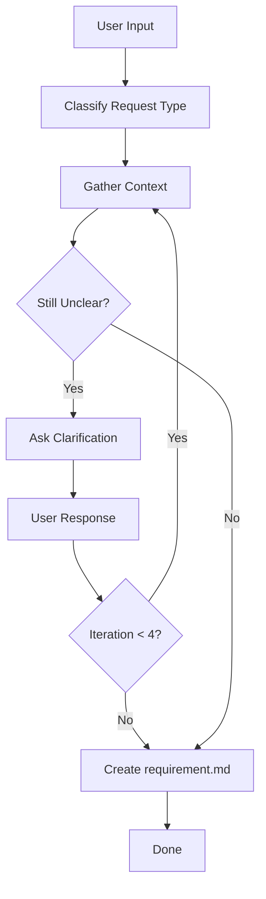

Transform user input into a structured requirement document.

## Core Principle

This phase is **research, exploration, and clarification only**. Focus exclusively on **what** the user needs and **why** — never on
**how** to implement it. Good requirements come from understanding, not jumping to solutions.

**If a request is unfeasible, decline it directly with an explanation.**

### Do

• Read and search the codebase (Grep, Glob, View)
• Research documentation and best practices
• Ask clarifying questions
• Describe findings in prose
• Identify patterns, dependencies, constraints
• Create the `requirement.md` document

### Do Not

• Think about implementation approaches or technical solutions
• Write, edit, or suggest code changes
• Provide code snippets, diffs, or pseudocode
• Offer implementation hints ("you could do X by...")
• Make file changes of any kind (except `requirement.md`)

## Workflow

---

## Step 1: Classify Request Type

Match user input against keywords to identify the request type:

| Type       | Keywords                                              | Description                                                                                          |
| ---------- | ----------------------------------------------------- | ---------------------------------------------------------------------------------------------------- |
| `feature`  | add, new, implement, create                           | A capability that **does not exist yet**. New behavior, endpoint, UI element, or command.            |
| `bug`      | fix, bug, error, broken, crash                        | Something **exists but works incorrectly**. Errors, crashes, wrong output, unexpected behavior.      |
| `improve`  | improve, faster, better, optimize, enhance            | Something **works but could be better**. Performance, UX, output quality — no broken behavior.       |
| `refactor` | refactor, clean up, reorganize, rename                | **Restructure code without changing observable behavior.** Renaming, deduplication, pattern changes. |
| `setup`    | setup, configure, install, initialize, add dependency | **Infrastructure, tooling, or configuration.** Not user-facing functionality.                        |
| `explore`  | how, why, what, research, investigate                 | **Pure question or investigation.** No code change implied — only understanding and research.        |

If ambiguous, **immediately ask the user** a closed question to determine the exact type before proceeding to Step 2.

---

## Step 2: Gather Context

Only gather information to build context. Do not reason, judge, or draw conclusions.

### Extract Keywords

Analyze user input and extract keywords by category:

- **Domain** — feature names, module names, business concepts
- **Technical** — library names, API names, protocols, patterns
- **Errors** (bugs only) — error messages, stack traces, status codes
- **Files** — file names, paths, directories mentioned or implied

Refine keywords after each clarification round in Step 3.

### Codebase

- Search for related functions, patterns, and dependencies using Grep, Glob, View
- Read files in chunks — never read an entire large file whole
- Prioritize: entry points → configs → types → implementations
- Check imports and dependencies of related files to map the affected surface
- Stop when you have enough context — don't be exhaustive

### External

- Use Context7 MCP to look up official docs for libraries/tools relevant to the request
- Search on internet for best practices, constraints, and known limitations
- Only search libraries already in the project or explicitly mentioned by user
- Skip if no relevant external docs exist

### Track References

As you research, maintain a running list of **useful** references discovered during Step 2 and Step 3. Only include references that actually informed the requirement — not everything you looked at.

| Type       | What to record                                    | Example                                                       |
| ---------- | ------------------------------------------------- | ------------------------------------------------------------- |
| Codebase   | File path with line number + brief relevance note | `src/lib/auth.ts:42` — current auth logic                     |
| Docs       | URL + title/topic                                 | https://docs.example.com/auth — OAuth2 setup guide            |
| Article    | URL + title                                       | https://blog.example.com/post — "Best practices for token..." |
| Discussion | URL + context (GitHub issue, forum thread, etc.)  | https://github.com/org/repo/issues/123 — related bug report   |

Drop any reference that turned out irrelevant after further research.

---

## Step 3: Clarify Requirements

**Maximum 4 iterations.**

### Transition Rules

Decide immediately after each user response:

- **User explicitly approves** → go to Step 4
- **Enough clarity, no gaps** → go to Step 4
- **Gaps remain** → ask the user, then return to Step 2
- **4 iterations reached** → go to Step 4 regardless

### Identify Gaps

Check these categories and list gaps explicitly before asking:

| Category                | Question                                       |
| ----------------------- | ---------------------------------------------- |
| Scope / Boundary        | What is in and out of scope?                   |
| Behavioral Ambiguity    | What happens in edge cases or failures?        |
| Missing Constraints     | Any limits on size, rate, format, performance? |
| Conflicting Information | Mismatches between code, docs, and request?    |
| User Preference         | UI style, defaults, ordering, naming?          |
| Acceptance Criteria     | How is success measured?                       |

### Draft Requirement

Summarize what you understand in 2–3 sentences. State assumptions openly. Update it every iteration.

### Ask Questions

- Prefer closed questions (Yes/No, multiple choice)
- Group related questions (max 2–3 at a time)
- Provide sensible defaults or options
- Never ask for information already gathered in Step 2
- Target the highest-impact gaps first

---

## Step 4: Create requirement.md

1. Read template from `assets/templates/{type}.md` (feature/bug/improve/refactor/setup/explore)
2. Fill sections based on gathered information
3. Set `createdAt` (YYYY-MM-DD HH:MM) and `title`
4. Fill the `## References` section with useful references tracked during research
5. Write to `.agents/flower/{YYMMDD-HHMM}--{short-desc}/requirement.md` . Run `date +"%y%m%d-%H%M"` to get datetime string.

---

## Output

Inform user: file path, classified type, brief summary.
