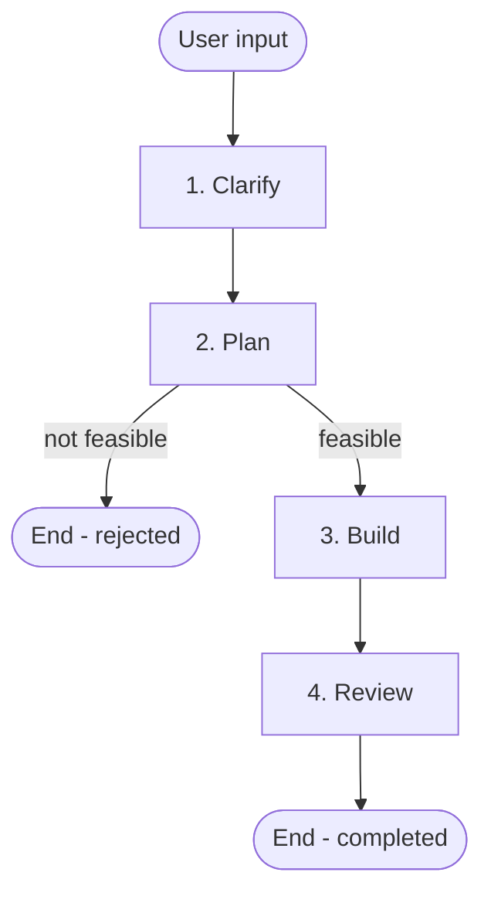

# flower workflow

## Workflow

## Phases

| #   | Phase   | Reference                                      |
| --- | ------- | ---------------------------------------------- |
| 1   | Clarify | [references/clarify.md](references/clarify.md) |
| 2   | Plan    | [references/plan.md](references/plan.md)       |
| 3   | Build   | [references/build.md](references/build.md)     |
| 4   | Review  | [references/review.md](references/review.md)   |

## Document Convention

Create a folder `.flower/quests/<datetime>--<short-description>/` when starting a new quest.

- `<datetime>` uses `YYMMDD-HHmm` format — run `uv run scripts/current_datetime.py` to generate it
- `<short-description>` is a kebab-case summary generated by the agent
- Folder contains `requirement.md`, `plan.md`, `journal.md`, and `review.md` based on templates in `.flower/templates/`.

## Rules

- When a phase begins, print `Phase <number>:<name>` for the user to easily follow
- Follow the workflow steps strictly. Do not skip or reorder steps.
