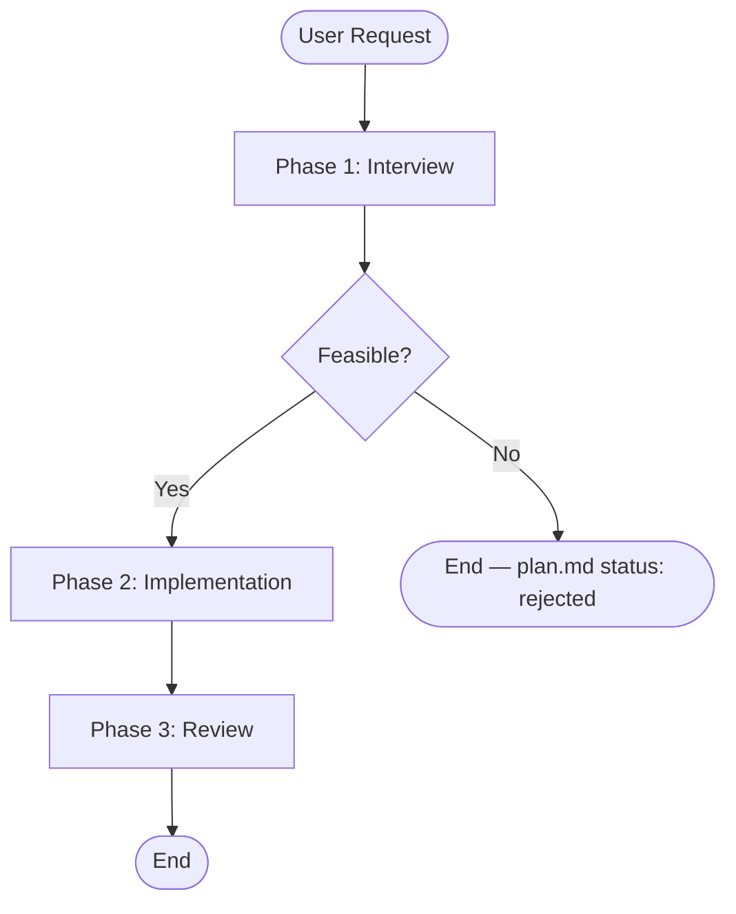

## Workflow

## Phases

| #   | Phase          | Reference                                                    | When                                                    |
| --- | -------------- | ------------------------------------------------------------ | ------------------------------------------------------- |
| 1   | Interview      | [references/interview.md](references/interview.md)           | User describes a feature, bug, or refactor to build     |
| 2   | Implementation | [references/implementation.md](references/implementation.md) | Interview is complete, requirement.md and plan.md ready |
| 3   | Review         | [references/review.md](references/review.md)                 | All tasks are done, ready for quality gate              |

Load only the reference file for the current phase. Do not read ahead.

## Document Convention

Quest docs: `.flower/quests/<datetime>--<short-description>/<document>.md` — one directory per quest, one file per phase.

Directory naming:

- `<datetime>` uses `YYMMDD-HHmm` format — run `date +"%y%m%d-%H%M"` to generate it
- `<short-description>` is a kebab-case summary generated by the agent (e.g. `add-user-auth`, `fix-login-bug`)
- Example: `.flower/quests/250228-1430--add-user-auth/`.

Files: `requirement.md`, `plan.md`, `journal.md`, `review.md`.

Templates: `.flower/templates/` — copy from template when creating a new phase document.

## Rules

- Read existing quest docs before making changes. Keep diffs minimal.
- One quest at a time — finish or park the current quest before starting another.
- Do not skip phases. Each phase's output is the next phase's input.
- When beginning any phase, print `# Phase <number>: <name>`.
