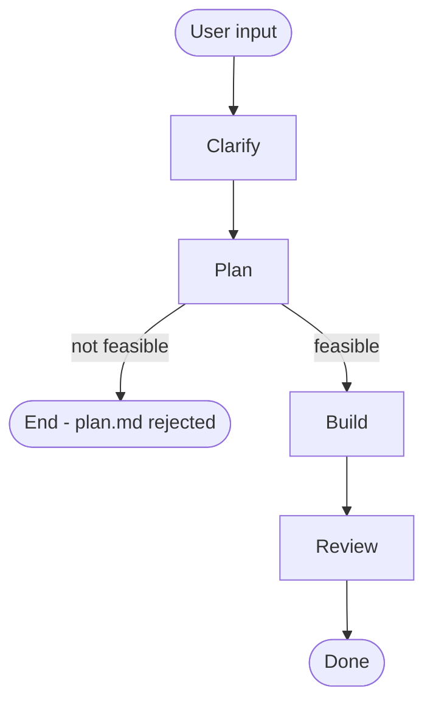

## Workflow

## Phases

| #   | Phase   | Reference                                      | When                                                    |
| --- | ------- | ---------------------------------------------- | ------------------------------------------------------- |
| 1   | Clarify | [references/clarify.md](references/clarify.md) | User describes a feature, bug, or refactor to build     |
| 2   | Plan    | [references/plan.md](references/plan.md)       | Interview is complete, requirement.md and plan.md ready |
| 3   | Build   | [references/build.md](references/build.md)     | All tasks are done, ready for quality gate              |
| 4   | Review  | [references/review.md](references/review.md)   | All tasks are done, ready for quality gate              |

Load only the reference file for the current phase. Do not read ahead.

## Document Convention

Create a folder `.flower/quests/<datetime>--<short-description>/` when starting a new quest.

- `<datetime>` uses `YYMMDD-HHmm` format — run `date +"%y%m%d-%H%M"` to generate it
- `<short-description>` is a kebab-case summary generated by the agent (e.g. `add-user-auth`, `fix-login-bug`)
- Folder contains `requirement.md`, `plan.md`, `log.md`, and `review.md` based on templates in `.flower/templates/`.

## Rules (**STRICTLY ENFORCED**)

- Print `# Phase <number>: <name>` **once** before each phase. After a phase is complete, **immediately** begin the next phase without asking.
- One quest at a time — finish or park the current quest before starting another
- Do not skip phases
