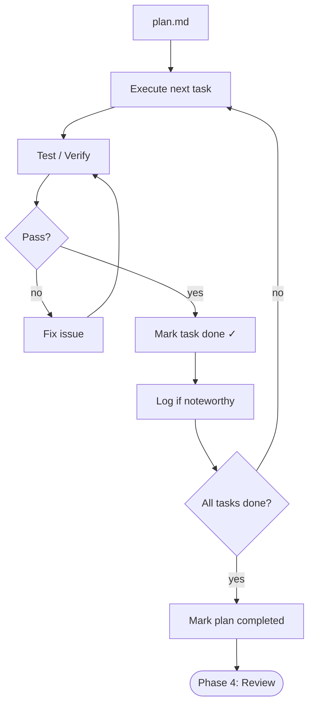

# Phase 3: Build

Execute tasks from `plan.md` in order. Test each one. Mark it done. Repeat.

## Workflow



## Input

- `requirement.md`
- `plan.md` with `status: in-progress`

## Steps

### 1. Execute task

Read the task's Description, AC, and Approach. Investigate relevant code. Implement. Stay in scope.

| Complexity   | Investigation       | Implementation          | Testing                  |
| ------------ | ------------------- | ----------------------- | ------------------------ |
| **Trivial**  | Quick scan          | Direct change           | Spot check               |
| **Standard** | Read related files  | Follow approach in plan | Related test suite       |
| **Complex**  | Deep codebase study | Incremental changes     | Full test suite + manual |

### 2. Test

Run relevant tests. Verify every AC passes. Fix failures before moving on. If unrelated tests were already failing, note in journal and leave them.

### 3. Mark task done — do not skip

**Immediately after tests pass**, check the checkbox in `plan.md`:

```
- [ ] Task title  →  - [x] Task title
```

This tracks resumable state. A task is not done until checked.

### 4. Log if noteworthy

Open `.flower/journal.md` (create from `templates/journal.md` on first use).

Log only when the plan was **not** followed exactly:

- Deviated from the planned approach
- Made a non-obvious decision
- Hit a problem and resolved it
- Discovered something reusable
- Added a new task

Entry format:

```markdown
### [Short title]
- **tags**: [keywords]
- **scope**: [global | project:<name>]
- **context**: [what you were doing]
- **insight**: [why — the decision, deviation, or discovery]
```

Skip if the plan was followed exactly with no surprises.

### 5. Mark plan as completed

After all tasks are checked, verify:

- [ ] All checkboxes checked
- [ ] All ACs verified
- [ ] All tests pass
- [ ] No unintended side effects
- [ ] Deviations captured in journal

Then set `status: completed` in plan frontmatter.

## Rules

- Never skip testing
- Never skip marking done — it tracks where to resume
- One task at a time; don't expand scope mid-task
- New work = new task in the plan, not an expansion of the current one
- Follow plan order; skip ahead only when blocked
- Don't fix unrelated issues — note them for a future quest
