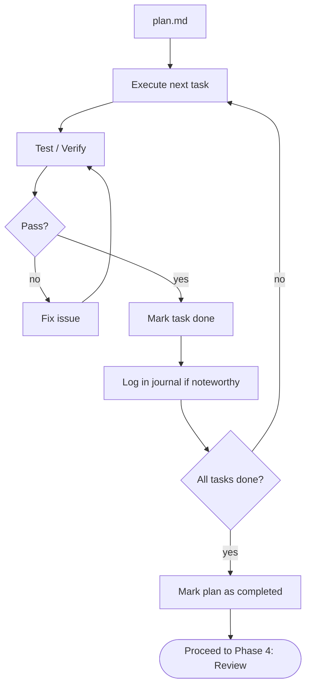

# Phase 3: Build

Execute tasks from `plan.md`, test each one, and log knowledge in the journal.

## Workflow (**STRICTLY ENFORCED**)



## Input

- `requirement.md`
- `plan.md` with `status: in-progress`

## Steps

### Execute task

For each task in plan order:

- Read the task's Description, AC, and Approach
- Investigate relevant code before changing it
- Implement following codebase conventions
- One logical change per task, as scoped in the plan

**Scale guidance:**

| Complexity   | Investigation       | Implementation          | Testing                  |
| ------------ | ------------------- | ----------------------- | ------------------------ |
| **Trivial**  | Quick scan          | Direct change           | Spot check               |
| **Standard** | Read related files  | Follow approach in plan | Related test suite       |
| **Complex**  | Deep codebase study | Incremental changes     | Full test suite + manual |

### Test / Verify

- Run relevant tests — unit, integration, or manual as appropriate
- Verify every AC for this task passes
- If tests fail → fix and re-verify; do not move on
- If unrelated tests were already failing → note in journal, do not fix

### Mark task done

Check the task checkbox in plan: `- [ ]` → `- [x]`

### Log in journal

Template: `.flower/templates/journal.md`

Only when something noteworthy happened. Skip if plan was followed exactly.

| Log this             | Example                                                      |
| -------------------- | ------------------------------------------------------------ |
| Deviation from plan  | "Used library X instead of Y because Y doesn't support Z"    |
| Non-obvious decision | "Chose eager loading — dataset is always small"              |
| Problem & resolution | "Circular dep between A and B — extracted C"                 |
| Discovery            | "Found existing utility that handles 80% — reused it"        |
| New task added       | "Added task 4b: migrate old data — discovered during task 4" |

Do **not** log: routine implementation, standard debugging, info already in commits.

**Entry format:**

```markdown
### [Short actionable title]

- **tags**: [comma-separated domain keywords]
- **scope**: [global | project:<name>]
- **context**: [What was being worked on]
- **insight**: [The decision, discovery, or deviation — focus on WHY]
```

Create journal file on first entry from template.

### Mark plan as completed

After all tasks are done, verify:

- [ ] All task checkboxes checked
- [ ] All task ACs verified
- [ ] All tests pass (full relevant test suite)
- [ ] No unintended side effects
- [ ] Journal captures all deviations
- [ ] Any tasks added during build are also completed

If gaps exist → fix before proceeding. Then set `status: completed` in plan frontmatter.

## Rules

- **Never skip testing** — every task verified before marking done
- **Don't change task scope** — update the plan first, note in journal
- **Add, don't expand** — new work = new task in the plan
- **Follow plan order** — respect dependencies; only skip ahead when blocked
- **Resumable state** — plan shows exactly where to resume (next unchecked task)
- **Don't fix unrelated issues** — note in journal for a future quest
