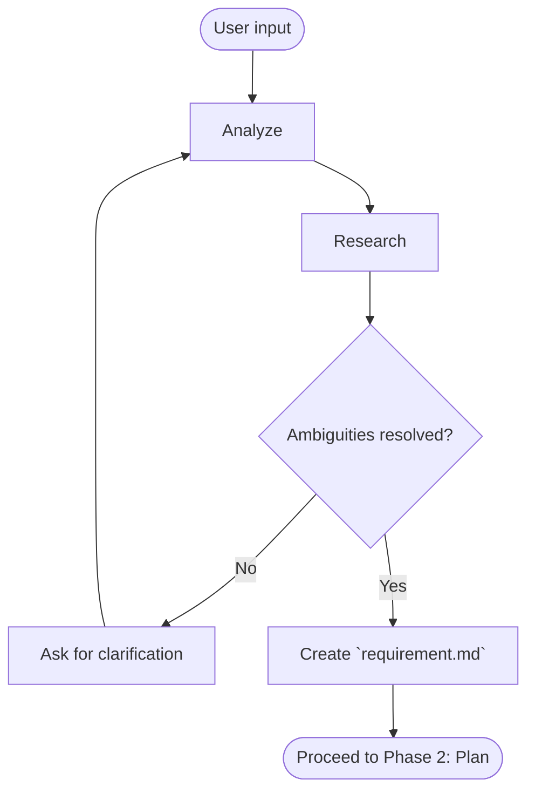

# Phase 1: Clarify

Clarify user requirements, clearly describing WHAT and WHY, **not** HOW.

## Workflow (**STRICTLY ENFORCED**)

## Steps

### Analyze

Read user input word by word. Extract:

- **Codebase keywords** → file names, modules, functions, endpoints, components mentioned — feed into codebase exploration
- **Technology keywords** → libraries, frameworks, languages, tools, APIs mentioned — feed into documentation lookup
- **Intent** → feature, bug fix, refactor, or enhancement
- **Constraints** → explicit or implicit limitations
- **Ambiguities** → anything with multiple interpretations — feed into clarification questions

### Research

Use extracted keywords to investigate before asking:

- **Codebase** → grep, glob, read files, `repomix` — understand existing code, patterns, architecture
- **Technology** → use MCPs (`context7`, ...), fetch - understand relevant docs for mentioned technologies
- **External**: look up APIs, standards, or domain concepts the human referenced

### Ask for clarification

Only if ambiguities remain after research:

| Rule            | Detail                                                                                |
| --------------- | ------------------------------------------------------------------------------------- |
| Provide options | Offer choices, not open-ended questions. E.g., "(a) partial, (b) exact, or (c) both?" |
| Batch questions | Group related questions. Max ~5 per round.                                            |
| Be specific     | Reference concrete code, files, or behaviors.                                         |
| Easy to answer  | Human should answer in a few words or by picking an option.                           |
| Show research   | Share what you found to give context to your question.                                |

After each response, restart: analyze → research based on new info → evaluate remaining ambiguities, gaps.

### Create `requirement.md`

Template in `.flower/templates/requirement.md`.

| Section                     | Content                                                             |
| --------------------------- | ------------------------------------------------------------------- |
| Problem                     | Who is affected, when, what goes wrong. 2–5 bullets. No solutions.  |
| User Stories                | "As a [user], I want [action] so that [benefit]"                    |
| Goals                       | Verifiable outcomes — each yes/no checkable                         |
| Non-Goals                   | Explicitly excluded — anything someone might assume is in scope     |
| Acceptance Criteria         | Given/When/Then — pass/fail testable, no subjective judgment        |
| Constraints & Prerequisites | Hard limits (unchangeable) + external requirements for this feature |
| Glossary                    | Domain-specific terms only. Skip if self-explanatory.               |

## Validate

- [ ] Every goal is concrete and verifiable
- [ ] Every goal has at least one acceptance criterion
- [ ] Scope boundaries are unambiguous
- [ ] All ambiguities from Q&A are resolved in the document — none deferred
- [ ] Constraints are realistic and compatible with each other

## Rules

- **Read before asking** — detect keywords and research the codebase first; only ask what you cannot answer yourself
- **Every word matters** — read the human's input thoroughly; do not skim or skip
- **Options over open-ended** — always provide choices when asking questions
- **Draft once, draft right** — documents must be accurate and complete on first draft; the Q&A phase exists to ensure this
- **Problem ≠ solution** — requirement describes what's wrong, not how to fix it
- **Non-Goals prevent scope creep** — invest effort here
- **Self-contained but concise** — a reader must understand the problem and success criteria without reading the codebase
- **No assumptions** — ambiguities must be resolved through research or Q&A, never assumed
