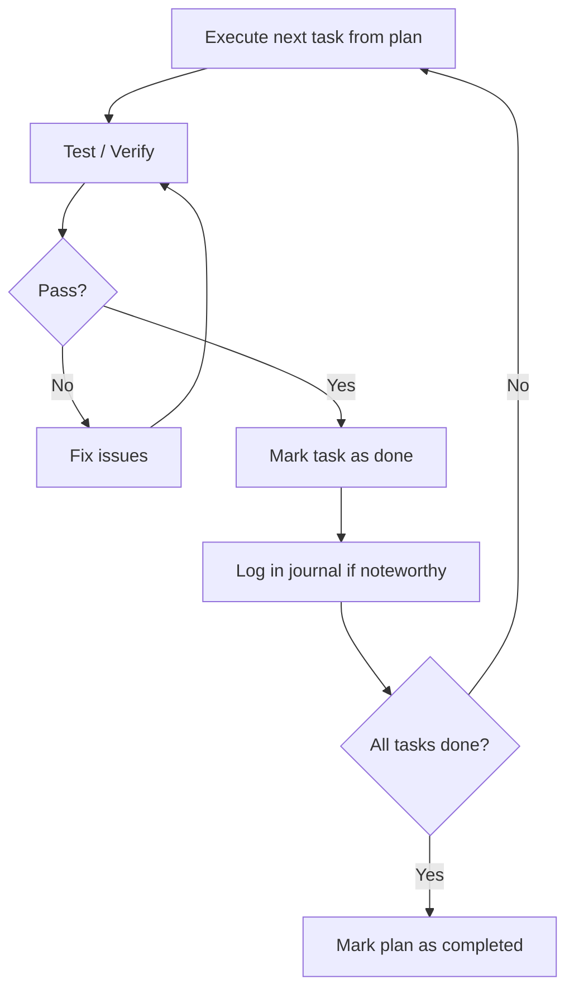

# Phase 2: Implementation

Execute tasks from the plan, test each one, and log knowledge in the journal.



## Input

- `requirement.md`
- `plan.md` with `status: in-progress`

## Steps

For each task in the plan (in order):

1. **Execute the task**
   - Read the task description, AC, and Approach
   - Investigate the relevant code area before making changes — understand what exists, how it connects, and what conventions are in place
   - Implement the change following codebase conventions and patterns
   - Keep changes focused — one logical change per task, as scoped in the plan

   **Scale guidance**: match rigor to the task's complexity.

   | Task Complexity | Investigation       | Implementation          | Testing                   |
   | --------------- | ------------------- | ----------------------- | ------------------------- |
   | **Trivial**     | Quick scan          | Direct change           | Spot check or single test |
   | **Standard**    | Read related files  | Follow approach in plan | Run related test suite    |
   | **Complex**     | Deep codebase study | Incremental changes     | Full test suite + manual  |

2. **Test / Verify**
   - Run relevant tests (unit, integration, or manual verification as appropriate)
   - Verify every AC for this task passes — each must be a clear pass/fail
   - If tests fail → fix the issue and re-verify (do not move on with failing tests)
   - If existing unrelated tests were already failing before your change → note in journal, do not fix

3. **Mark task as done**
   - Check the task checkbox in the plan document: `- [ ]` → `- [x]`

4. **Log in journal** (only when something noteworthy happened)
   - If the plan was followed exactly with nothing unusual → skip the journal entry
   - See Journal Guidelines below for what to log and the required format

After all tasks are done:

5. **Run completion checklist**

   Before marking the plan as completed, verify:
   - [ ] All task checkboxes are checked
   - [ ] All task ACs have been verified
   - [ ] All tests pass (run full relevant test suite, not just per-task)
   - [ ] No unintended side effects introduced (check areas adjacent to changes)
   - [ ] Journal captures all deviations and non-obvious decisions
   - [ ] Any tasks added during implementation are also completed

   If gaps exist → fix them before proceeding.

6. **Fill Deviations from Plan** table in journal (if journal exists) — summarize differences between planned and actual approach by pulling from entries above

7. **Mark plan as completed** → set `status: completed` in frontmatter

## Journal Guidelines

Create journal file on first noteworthy entry from template: `.flower/quests/<datetime>--<short-description>/journal.md`

Each entry must use the structured format for future retrieval:

```markdown
### [Short actionable title]
- **tags**: [comma-separated domain keywords]
- **scope**: [global | project:<name>]
- **context**: [What was being worked on]
- **insight**: [The decision, discovery, or deviation — focus on WHY]
```

**What to log**:

| Type                 | Example                                                             |
| -------------------- | ------------------------------------------------------------------- |
| Deviation from plan  | "Used library X instead of Y because Y doesn't support feature Z"   |
| Non-obvious decision | "Chose eager loading over lazy because the dataset is always small" |
| Problem & resolution | "Circular dependency between A and B — resolved by extracting C"    |
| Discovery            | "Found existing utility that handles 80% of this — reused it"       |
| New task added       | "Added task 4b: migrate old data — discovered during task 4"        |

**What NOT to log**:

- Routine implementation that followed the plan exactly
- Standard debugging (typo fixes, missing imports)
- Information already captured in commit messages

## Output

- `plan.md` with `status: completed` (all tasks checked)
- `journal.md` (only if noteworthy events occurred)
- Proceed to Phase 3: Review

## Rules

- **Never skip testing** — every task must be verified before marking done
- **Do not change task scope during implementation** — if scope needs to change, update the plan first and note in journal
- **Add, don't expand** — if a task reveals new work, add a new task to the plan rather than expanding the current one
- **Follow the plan's order** — respect task dependencies; only skip ahead when blocked
- **Keep journal structured** — use the tagged format for every entry to enable future search and retrieval
- **Resumable state** — if implementation is interrupted, the plan document shows exactly where to resume (next unchecked task)
- **Don't fix unrelated issues** — note them in the journal for a future quest
