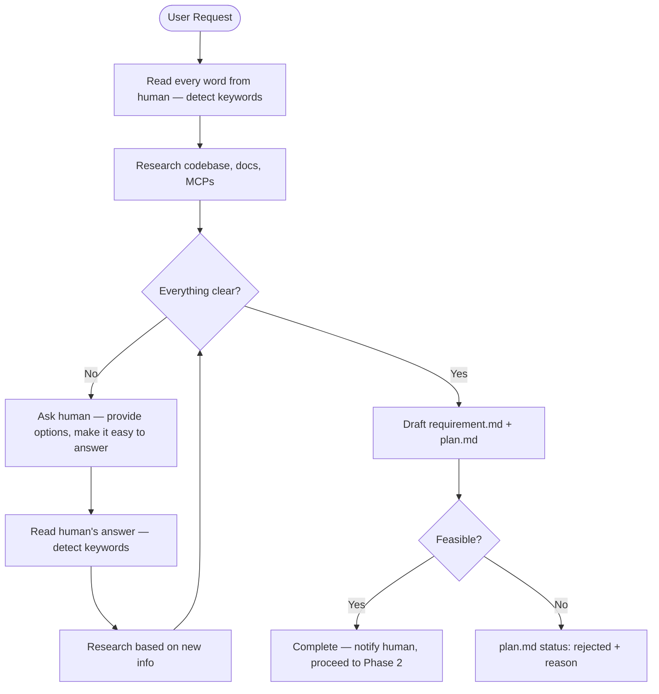

# Phase 1: Interview

Understand the problem deeply through structured Q&A with the human, research the codebase and docs, then produce `requirement.md` and `plan.md` — both must be accurate, clear, actionable, and free of errors.

## Input

- Human's description of the feature, bug, or refactor
- Templates: `.flower/templates/requirement.md`, `.flower/templates/plan.md`

## Steps

### 1. Read & Detect

Read the human's input **word by word**. Identify:

- **Keywords** — technologies, patterns, domain terms, file names, module names
- **Intent** — what the human wants to achieve (feature, bug fix, refactor, enhancement)
- **Constraints** — explicit or implicit limitations mentioned
- **Ambiguities** — anything that could be interpreted multiple ways

Do not skim. Do not summarize prematurely. Every word matters.

### 2. Research

Use the detected keywords to investigate **before** asking questions:

- **Codebase** — grep, glob, file reading to understand existing code, patterns, data models, architecture
- **Docs & libraries** — use documentation tools and MCPs to understand capabilities and constraints of mentioned technologies
- **External sources** — look up APIs, services, standards, or domain concepts referenced by the human

The goal: reduce the number of questions by answering what you can through research.

### 3. Q&A (dynamic rounds — skip if everything is clear)

If ambiguities remain after research, ask the human. Follow these rules strictly:

| Rule                   | Detail                                                                                                                                                                    |
| ---------------------- | ------------------------------------------------------------------------------------------------------------------------------------------------------------------------- |
| **Provide options**    | Always offer solutions/choices. Never ask open-ended questions when options are possible. E.g. "Should search support: (a) partial matches, (b) exact only, or (c) both?" |
| **Batch questions**    | Group related questions in one message. Max ~5 questions per round.                                                                                                       |
| **Be specific**        | Vague questions get vague answers. Reference concrete code, files, or behaviors.                                                                                          |
| **Easy to answer**     | The human should be able to answer in a few words or by picking an option.                                                                                                |
| **Show your research** | When relevant, share what you found in the codebase to give context to your question.                                                                                     |

After each human response:

1. **Read every word again** — detect new keywords and intent shifts
2. **Research again** — use new information to investigate further
3. **Evaluate** — are there still gaps? If yes → ask again. If no → proceed to drafting.

The loop continues until **everything is genuinely clear**. Do not rush to drafting.

### 4. Draft Documents

When all ambiguities are resolved, create both documents simultaneously.

#### requirement.md

Create from template.

**Scale guidance**: match depth to complexity.

- **Small** (typo fix, config change) — fill only Problem, Goals, and Acceptance Criteria. Skip sections that would be forced or empty.
- **Standard** (feature, bug fix, refactor) — fill all sections.
- **Complex** (cross-cutting, multi-system) — fill all sections with extra detail on Constraints and Non-Goals.

| Section                         | What to write                                                                      |
| ------------------------------- | ---------------------------------------------------------------------------------- |
| **Problem**                     | Who is affected, when it occurs, what goes wrong. 2–5 bullets. No solutions.       |
| **User Stories**                | "As a [user], I want to [action] so that [benefit]"                                |
| **Scope: Goals**                | Verifiable outcomes — each must be yes/no checkable                                |
| **Scope: Non-Goals**            | What is explicitly excluded — anything someone might reasonably assume is in scope |
| **Acceptance Criteria**         | Given/When/Then — each must be pass/fail testable without subjective judgment      |
| **Constraints & Prerequisites** | Hard limits (can't change) + things outside scope but required for this feature    |
| **Glossary**                    | Domain-specific terms only. Skip if all terms are self-explanatory                 |

#### plan.md

Create from template. Set `status: in-progress`.

| Section                 | What to write                                                                                          |
| ----------------------- | ------------------------------------------------------------------------------------------------------ |
| **Overview**            | 2-3 sentences: what is being built, the general approach, and key technical choices                    |
| **Technical Decisions** | Non-obvious decisions that affect multiple tasks. State WHAT and WHY. Include alternatives if complex. |
| **Tasks**               | Ordered by dependency. One logical change per task. Each task has its own AC and Approach.             |
| **Dependencies**        | Internal and external. Skip if none.                                                                   |
| **Risks & Mitigation**  | Only risks that would change the plan. Skip if none.                                                   |

**Task format** — each task must include:

| Field           | Required | What to write                                                              |
| --------------- | -------- | -------------------------------------------------------------------------- |
| **Description** | Yes      | Clear imperative statement of what to do                                   |
| **AC**          | Yes      | Acceptance criteria specific to this task — pass/fail verifiable           |
| **Approach**    | Yes      | How to implement — concrete steps, files to touch, patterns to follow      |
| **Blocked by**  | No       | Task dependency — only when a task must complete before this one can start |

### 5. Validate

Before completing, verify both documents against this checklist:

**requirement.md**:

- [ ] Every goal is concrete and verifiable
- [ ] Every goal has at least one acceptance criterion
- [ ] Scope boundaries are unambiguous
- [ ] All ambiguities from Q&A are resolved in the document — none deferred
- [ ] Constraints are realistic and compatible with each other

**plan.md**:

- [ ] Every requirement goal maps to at least one task
- [ ] Every acceptance criterion is covered by at least one task's AC
- [ ] Tasks are ordered by dependency
- [ ] Each task has AC and Approach
- [ ] Technical decisions are grounded in codebase investigation
- [ ] No task description says "X and Y" (split if so)

**Feasibility check**:

- If **feasible** → set plan.md `status: in-progress`, proceed
- If **not feasible** → set plan.md `status: rejected`, add `## Rejection Reason` section explaining why. End workflow.

### 6. Complete & Proceed

- Notify the human that Interview is complete and Implementation is starting
- **Immediately** proceed to Phase 2: Implementation — do not wait for approval

## Output

- `requirement.md`
- `plan.md` with `status: in-progress` (or `status: rejected` if not feasible)

## Rules

- **Read before asking** — detect keywords and research the codebase first; only ask what you cannot answer yourself
- **Every word matters** — read the human's input thoroughly; do not skim or skip
- **Options over open-ended** — always provide choices when asking questions
- **Draft once, draft right** — both documents must be accurate and complete on first draft; the Q&A phase exists to ensure this
- **Problem ≠ solution** — requirement describes what's wrong, not how to fix it
- **Non-Goals prevent scope creep** — invest effort here
- **Self-contained but concise** — a reader must understand the problem and success criteria without reading the codebase
- **No assumptions** — ambiguities must be resolved through research or Q&A, never assumed
- **Feasibility is binary** — either the plan is actionable as written, or it's rejected with a clear reason
