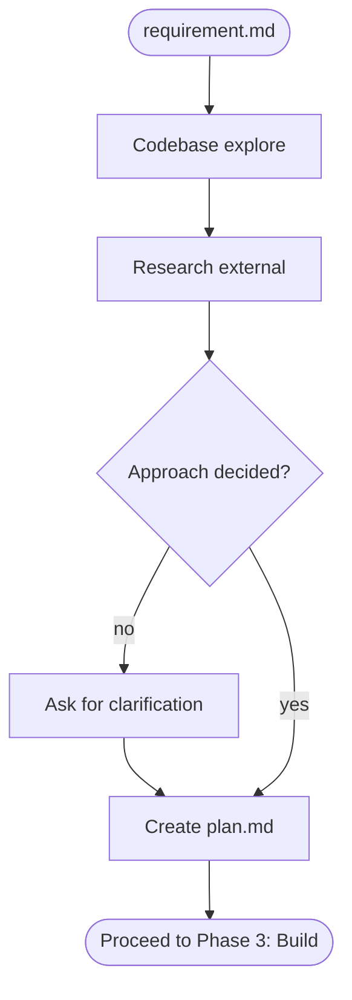

# Phase 2: Plan

Research HOW to implement `requirement.md` — explore the codebase, study external docs, decide the approach, and produce `plan.md`.

## Workflow

## Steps

### Codebase explore

Use goals and acceptance criteria from `requirement.md` as search targets:

- **Architecture** — modules, layers, data flow relevant to the requirement
- **Patterns** — how similar features are implemented; conventions to follow
- **Reuse** — what already exists vs. what must be built

Tools: grep, glob, read files, `repomix`.

### Research external

For every technology, library, or pattern relevant to the requirement:

- **Docs** — capabilities, limitations, API surface
- **Best practices** — recommended approaches, common pitfalls
- **Alternatives** — competing libraries or patterns that solve the same problem

Tools: `context7`, fetch, web search.

### Ask for clarification

When approach is NOT decided — ask. Do not decide alone.

| Trigger                   | What to present                        |
| ------------------------- | -------------------------------------- |
| Multiple valid approaches | Each option with pros, cons, tradeoffs |
| New library or dependency | What it does, why needed, alternatives |
| Significant tradeoff      | What is gained vs. given up            |

| Rule            | Detail                                                 |
| --------------- | ------------------------------------------------------ |
| Provide options | Offer choices with tradeoffs, not open-ended questions |
| Show research   | Share findings to give context                         |
| Batch questions | Group related decisions. Max ~5 per round              |
| Be specific     | Reference concrete code, libraries, or behaviors       |

### Create `plan.md`

Template in `.flower/templates/plan.md`. Set `status: in-progress`.

| Section             | Content                                                             |
| ------------------- | ------------------------------------------------------------------- |
| Overview            | 2-3 sentences: what is being built, approach, key technical choices |
| Technical Decisions | Non-obvious decisions. WHAT, WHY, alternatives considered           |
| Tasks               | Ordered by dependency. One logical change per task                  |
| Dependencies        | Internal and external. Skip if none                                 |
| Risks & Mitigation  | Only risks that would change the plan. Skip if none                 |

Each task must have:

| Field       | Required | Content                                            |
| ----------- | -------- | -------------------------------------------------- |
| Description | Yes      | Clear imperative statement                         |
| AC          | Yes      | Pass/fail verifiable criteria                      |
| Approach    | Yes      | Concrete steps, files to touch, patterns to follow |
| Blocked by  | No       | Task dependency                                    |

If no viable approach exists → set `status: rejected`, fill `## Rejection Reason`. End workflow.

## Validate

- [ ] Every requirement goal maps to at least one task
- [ ] Every acceptance criterion is covered by a task's AC
- [ ] Tasks ordered by dependency
- [ ] Each task has AC and Approach
- [ ] Technical decisions grounded in codebase research
- [ ] No compound tasks — split any "X and Y"

## Rules

- **Research before deciding** — explore codebase and docs before forming an approach
- **Surface choices** — when multiple approaches exist, present them with tradeoffs; never pick silently
- **New deps need approval** — never add a library to the plan without asking
- **Decisions in the document** — every choice from Q&A must appear in Technical Decisions
- **One task, one change** — if a description uses "and", split it
- **Concrete over vague** — Approach must name files, functions, and patterns
