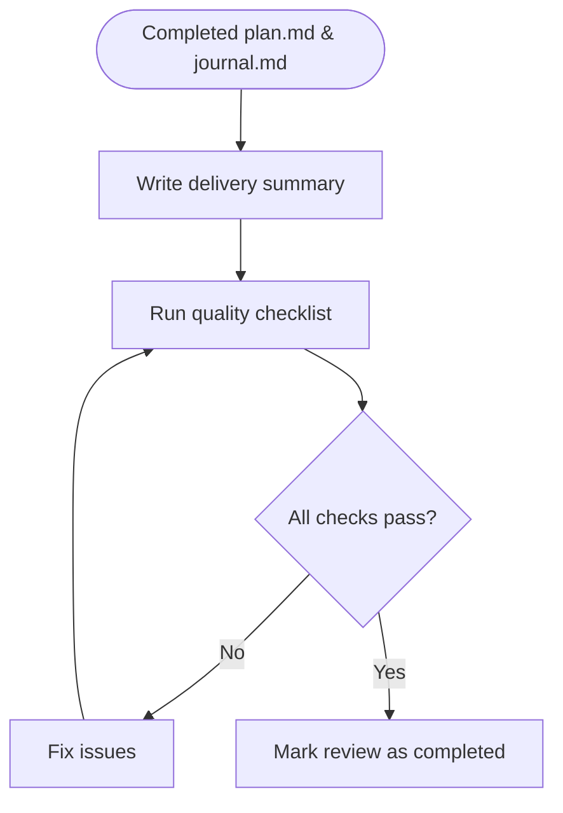

# Phase 3: Review

Quality gate and delivery summary. Verify everything not covered by task-level testing: security, performance, project standards, and overall correctness.

## Workflow (**STRICTLY ENFORCED**)



## Input

- `plan.md` with `status: completed` (all tasks checked)
- `journal.md` (if entries exist)
- Template: `.flower/templates/review.md`

## Steps

1. **Write delivery summary**

   Create `review.md` from the template in the quest directory. Set `status: draft`.

   **Scale guidance**: match depth to the quest's scope.

   | Quest Size | Summary Length | Metrics              | Outcome Detail    |
   | ---------- | -------------- | -------------------- | ----------------- |
   | **Small**  | 2-3 sentences  | Skip if not measured | Brief outcome     |
   | **Medium** | 3-5 sentences  | Key metrics only     | Outcome + context |
   | **Large**  | 5-8 sentences  | Full metrics         | Detailed outcome  |

   Write the summary covering:
   - **What was delivered** — concrete deliverables (features, fixes, refactors), not process steps
   - **Overall outcome** — did it meet the requirement's goals? Any goals partially met or adjusted?
   - **Key metrics** — lines changed, test coverage delta, performance improvement, or other measurable results (when available and meaningful)
   - **Notable deviations** — significant differences from the original plan, if any (reference journal for details)

   The summary must be **self-contained** — someone reading only the review doc should understand what was delivered and whether it succeeded, without referring to the requirement, plan, or journal.

2. **Run quality checklist**

   Go through each item systematically. For each: verify → fix if needed → check off.
   - [ ] **Dead code & unused files removed** — check for commented-out code, unused imports, orphaned files created during implementation, and temporary debug code
   - [ ] **Project standards followed** — verify code style, file structure, naming conventions, and linting rules match the rest of the codebase
   - [ ] **No security issues** — scan for hardcoded secrets, SQL injection, XSS, auth bypass, exposed internal errors, and overly permissive permissions
   - [ ] **Performance acceptable** — check for N+1 queries, unnecessary re-renders, unbounded loops, large payloads, missing pagination, and missing indexes
   - [ ] **All tests pass** — run the full relevant test suite (not just per-task tests from Phase 2); verify no regressions were introduced
   - [ ] **Documentation up to date** — README, API docs, inline docs, and config examples reflect the changes (skip if no user-facing docs exist)

   If fixing an issue requires code changes:
   1. Make the fix
   2. Re-run the **full checklist** from the top (a fix can introduce new issues)
   3. Repeat until all items pass cleanly in a single run

3. **Write memories**

   Record knowledge gained during this quest for future retrieval. Each memory entry uses the structured format:

   ```markdown
   ### [Short actionable title — 5-12 words]

   - **content**: [Detailed explanation with context and examples]
   - **tags**: [comma-separated domain keywords]
   - **scope**: [global | project:<name>]
   ```

   Skip if no meaningful knowledge was gained.

4. **Mark review as completed** → set `status: completed` in frontmatter

## Output

- Completed `review.md` with `status: completed`
- Summary of delivery shared with the human

## Rules

- **Summary stands alone** — a reader with no context must understand what was delivered and whether it succeeded
- **Never skip quality checks** — they catch issues that slip through during implementation; rushing here undermines the entire workflow
- **Full re-run after fixes** — if quality checks reveal issues requiring code changes, re-run the entire checklist afterward; partial re-checks miss cascading problems
- **Don't gold-plate** — quality checks fix real issues, they do not refactor working code or add enhancements beyond the quest's scope
- **Reference, don't repeat** — the summary may reference the plan or journal for details, but must not require them to be understood

## Status Lifecycle

| Status      | Meaning                                 |
| ----------- | --------------------------------------- |
| `draft`     | Initial creation, summary being written |
| `completed` | Quality checks passed, quest done       |
