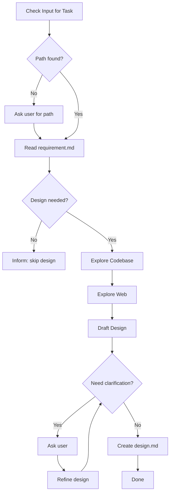

# Flower Design

Create technical design documentation from requirements.

## Workflow



| Step | Action                 |
| ---- | ---------------------- |
| 1    | Get Task Path          |
| 2    | Read Requirement       |
| 3    | Assess Need            |
| 4    | Explore Codebase & Web |
| 5    | Draft Design           |
| 6    | Clarify Loop (max 4)   |
| 7    | Create design.md       |

---

## Step 1: Get Task Path

**Check user input first.** Look for:

- Full path: `.agents/flower/250411-1430--add-dark-mode-toggle`
- Folder name: `250411-1430--add-dark-mode-toggle`
- Partial match: `dark-mode`, `add-dark-mode`

**If not found in input**, ask user:

> "Which task are you working on? Provide the folder name or path."
>
> Example: `250411-1430--add-dark-mode-toggle`

**After user provides:**

- Construct full path: `.agents/flower/{folder-name}`
- Verify `requirement.md` exists
- If not found, ask again

---

## Step 2: Read Requirement

Read `.agents/flower/{folder-name}/requirement.md`

Extract:

- Task type (feature/bug/improve/refactor/setup/explore)
- What needs to be built
- Acceptance criteria
- Any technical notes

---

## Step 3: Assess Need

**Design is needed when:**

- New feature with multiple components
- Backend API changes
- Database schema changes
- Integration with external services
- Refactoring affecting architecture
- Complex state management
- Performance-critical changes

**Design can be skipped when:**

- Small bug fix (single file)
- Simple configuration/setup
- Minor UI tweak
- Trivial refactoring (rename, extract)

**If skipping:**

> "This task is simple enough. Skipping design."

Then stop. Do not create design.md.

---

## Step 4: Explore

### Explore Codebase

Search for:

- Similar existing code (Grep, Glob)
- Current patterns and conventions
- Dependencies and configurations
- Related modules

### Explore Web (if helpful)

Search for:

- Best practices for this type of task
- Library/framework documentation
- Similar implementations

Keep research focused. Don't over-research.

---

## Step 5: Draft Design

Based on task type, draft the design:

### Determine Task Type

| Type               | Focus Areas                                        |
| ------------------ | -------------------------------------------------- |
| **Frontend**       | Components, State, Routing, Styling, Data Fetching |
| **Backend**        | API, Database, Services, Auth, Caching             |
| **Mobile**         | Platform, Offline, Navigation, Native              |
| **Infrastructure** | Deployment, Scaling, Monitoring                    |
| **Refactor**       | Current state, Target state, Migration             |
| **Integration**    | External API, Auth, Data mapping                   |

### Draft Key Sections

**Overview**: High-level architecture (use mermaid if helpful)

**Key Decisions**: Important choices and rationale

**Implementation Details**: Technical specifics based on task type

**Risks**: Known risks and mitigations

---

## Step 6: Clarify Loop

**Maximum 4 iterations.** Present draft to user and ask for feedback.

### How It Works

1. **Present**: Show the drafted design
2. **Ask**: "Does this design look good? Any concerns or changes?"
3. **Receive**: Get user feedback
4. **Refine**: Update design based on feedback
5. **Repeat**: Ask again until approved or max iterations

### Question Guidelines

- Prefer closed questions (Yes/No, multiple choice) over open-ended
- One question at a time, or max 2-3 related questions together
- Use information from exploration to avoid asking what's already known
- Stop early if design is approved

### Exit Conditions

Exit the loop and create design.md when ANY of these is true:

| Condition            | Action                      |
| -------------------- | --------------------------- |
| User approves design | Proceed to create design.md |
| Iteration count = 4  | Proceed with current draft  |

---

## Step 7: Create design.md

### Load Template

Read `assets/templates/design.md`

### Fill Content

1. Set `title` matching the requirement
2. Set `createdAt` to current datetime (format: YYYY-MM-DD HH:MM)
3. Fill all sections with drafted content
4. Ensure task type-specific details are included

### Write File

Create at: `.agents/flower/{folder-name}/design.md`

---

## Output

Inform user:

- File created
- Key decisions made
- Summary of design

Example:

```
Created: .agents/flower/250411-1430--add-dark-mode-toggle/design.md

Key Decisions:
- CSS variables for theming (simple, performant)
- React Context for state (lightweight)
- localStorage for persistence

Design Summary:
- Toggle component in header
- System preference detection on mount
- Smooth transition between modes
```

---

## Template

Located at `assets/templates/design.md`:
