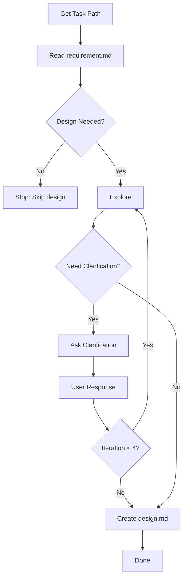

Create technical design documentation from requirements.

## Core Principle

This phase is **thinking and documentation only**. Focus on **how** to implement what was defined in requirements. Design is expensive — only do it when truly necessary.

**If a task doesn't need design, say so explicitly and stop. Do not create design.md.**

### Do

- Read and search the codebase (Grep, Glob, View)
- Research documentation, patterns, best practices
- Analyze existing architecture and patterns
- Sketch diagrams and describe architecture
- Document technical decisions with rationale
- Ask clarifying questions about implementation approaches
- Create the `design.md` document

### Do Not

- Write, edit, or suggest code changes
- Provide implementation code or snippets
- Make file changes of any kind (except `design.md`)

## Workflow

| Step | Action              | Output                              |
| ---- | ------------------- | ----------------------------------- |
| 1    | Get Task Path       | Folder path with requirement.md     |
| 2    | Read requirement.md | Understand what to design           |
| 3    | Assess Need         | Decision: design or skip            |
| 4    | Explore             | Codebase findings, Web research     |
| 5    | Clarify Loop        | Max 4 iterations                    |
| 6    | Create design.md    | `.agents/flower/{folder}/design.md` |

---

## Step 1: Get Task Path

Check user input for path, folder name, or partial match. Construct full path `.agents/flower/{folder-name}` and verify files exist. If not found, ask user.

---

## Step 2: Read requirement.md

Read `.agents/flower/{folder-name}/requirement.md`

Extract:

- Task type (feature/bug/improve/refactor/setup/explore)
- What needs to be built
- Acceptance criteria
- Constraints and non-goals
- Any technical notes

---

## Step 3: Assess Need

**Be rigorous.** Design is expensive — only do it when truly necessary.

Evaluate in this exact order. Stop at the first match.

### 1. Auto-Skip

Skip design if the task is ANY of these:

- **Follows existing pattern** in the codebase
- **Single area, no cross-cutting impact** (≤ 2 files, no schema change)
- **Trivial impact** — wrong approach causes no runtime risk (e.g., renaming, formatting, logging)

**Action:** Say "Skipping design: [reason]. [Brief approach]." Then stop.

### 2. Auto-Design

Need design if the task is ANY of these:

- **Security-sensitive** (auth, permissions, encryption, payments)
- **New architecture/pattern** not existing in the codebase
- **External integration** with complex constraints (third-party API, gateway)

**Action:** Say "Need design: [reason]." Then continue to Step 4.

### 3. Evaluate Remaining Tasks

For everything else, need design if **2 or more** are true:

- **Ambiguous approach** — multiple valid implementations with different trade-offs
- **High rework cost** — affects 3+ files/modules or requires migration
- **Schema/data model change** — affects multiple consumers or APIs

**Action:** Need design → continue to Step 4. Otherwise → skip.

---

## Step 4: Explore

Gather information to design the solution. Focus on **how** things are built.

### Codebase

Search for:

| Priority | Search For                       | Tools                                          |
| -------- | -------------------------------- | ---------------------------------------------- |
| 1        | Entry points for this feature    | Grep for route handlers, CLI commands, exports |
| 2        | Similar existing implementations | Grep for patterns, Glob for related files      |
| 3        | Data models and types            | View schema files, type definitions            |
| 4        | Dependencies and imports         | Check imports of related files                 |
| 5        | Configuration and environment    | View config files, env handling                |
| 6        | Error handling patterns          | Grep for try/catch, error types                |

**For new features:**

- Find where similar features are implemented
- Check what patterns are already established
- Look for shared utilities and helpers
- Identify integration points

**For bugs:**

- Find the failing code path
- Trace the data flow
- Identify where the fix should go
- Check for similar bugs fixed before

**For refactoring:**

- Map current structure
- Find all usages of code being refactored
- Identify breaking change surface
- Check test coverage

### External

Use Context7 MCP for library/framework documentation:

Search for:

- Library docs and best practices
- Implementation patterns
- Known limitations or gotchas

Only search libraries already in the project or explicitly mentioned.

### Track References

Maintain a running list of useful references:

| Type     | Format                                        |
| -------- | --------------------------------------------- |
| Codebase | `src/path/file.ts:42` — brief note            |
| Docs     | `https://docs.example.com/topic` — brief note |
| Article  | `https://blog.example.com/post` — brief note  |

Only include references that actually informed the design.

### Stop When

You have enough context to draft the design. Don't be exhaustive.

---

## Step 5: Clarify Loop

**Maximum 4 iterations.**

### Transition Rules

Decide immediately after each user response:

- **User explicitly approves** → go to Step 6
- **Enough clarity, no gaps** → go to Step 6
- **Gaps remain** → ask the user, then return to Step 4
- **4 iterations reached** → go to Step 6 regardless

### Identify Gaps

Check these categories and list gaps explicitly before asking:

|                      | Category                             |
| -------------------- | ------------------------------------ |
| Architecture Choice  | Which pattern fits best?             |
| Trade-off Acceptance | Is the trade-off acceptable?         |
| Missing Context      | Need more info to decide?            |
| Alternative Options  | Should we consider other approaches? |
| Implementation Order | What to build first?                 |
| Risk Tolerance       | Acceptable risk level?               |

### Draft Design

Summarize the design in 2–3 sentences. State decisions and trade-offs openly. Update it every iteration.

### Ask Questions

- Prefer closed questions (Yes/No, multiple choice)
- Group related questions (max 2–3 at a time)
- Present options with trade-offs
- Never ask for information already gathered in Step 4
- Target the highest-impact gaps first

---

## Step 6: Create design.md

1. Read template from `assets/templates/design.md`
2. Fill all sections based on gathered information
3. Set `createdAt` (YYYY-MM-DD HH:MM) and `title` (from requirement)
4. Fill the `## References` section with useful references tracked during research
5. Write to `.agents/flower/{folder-name}/design.md`

---

## Output

Inform user:

- File path
- Key decisions made
- Next step suggestion (plan phase)
