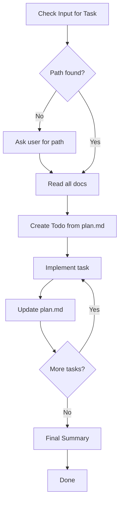

# Flower Implement

Execute implementation tasks from the plan.

## Workflow



| Step | Action                     |
| ---- | -------------------------- |
| 1    | Get Task Path              |
| 2    | Read All Documents         |
| 3    | Create Todo List           |
| 4    | Implement Task             |
| 5    | Update plan.md (MANDATORY) |
| 6    | Repeat Until Done          |
| 7    | Final Summary              |

---

## Step 1: Get Task Path

**Check user input first.** Look for:

- Full path: `.agents/flower/250411-1430--add-dark-mode-toggle`
- Folder name: `250411-1430--add-dark-mode-toggle`
- Partial match: `dark-mode`, `add-dark-mode`

**If not found in input**, ask user:

> "Which task are you working on? Provide the folder name or path."
>
> Example: `250411-1430--add-dark-mode-toggle`

**After user provides:**

- Construct full path: `.agents/flower/{folder-name}`
- Verify `requirement.md` and `plan.md` exist
- If not found, ask again

---

## Step 2: Read All Documents

### Read Order

1. **requirement.md** - Understand what to build
2. **design.md** (if exists) - Understand how to build
3. **plan.md** - Understand task order

### Extract from Each

**From requirement.md:**

- Task type
- Acceptance criteria
- Constraints

**From design.md:**

- Architecture decisions
- Technical approach
- Implementation patterns

**From plan.md:**

- Task breakdown
- Task order and dependencies
- Acceptance criteria per task

---

## Step 3: Create Todo List

### Parse plan.md

Extract all tasks with checkboxes:

- `- [ ] 1.1 Task description`
- `- [ ] 1.2 Task description`
- etc.

### Create Todo Items

Use the `todos` tool to create a todo item for each task:

```
- Implement 1.1: Task description (pending)
- Implement 1.2: Task description (pending)
- Implement 2.1: Task description (pending)
```

Mark the first task as `in_progress` before starting.

---

## Step 4: Implement Task

### Before Each Task

1. **Mark as in_progress** in todo list
2. **Review AC** for this specific task
3. **Check dependencies** from previous tasks
4. **Review design** for implementation guidance

### Implementation Principles

Always follow these principles:

| Principle | Meaning                  | Application                                  |
| --------- | ------------------------ | -------------------------------------------- |
| **DRY**   | Don't Repeat Yourself    | Extract reusable code into functions/modules |
| **YAGNI** | You Aren't Gonna Need It | Only implement what's required now           |
| **KISS**  | Keep It Simple, Stupid   | Choose simplest solution that works          |

### During Implementation

- Write clean, readable code
- Follow existing code patterns
- Keep functions small and focused
- Add tests if applicable
- Handle errors appropriately

### After Implementing Task

1. Verify the task works as expected
2. Run tests if available
3. Check AC for this task
4. Prepare to update plan.md

---

## Step 5: Update plan.md (MANDATORY)

**This step is mandatory after each task. Never skip.**

### Update Process

After completing a task, immediately update `.agents/flower/{folder-name}/plan.md`:

1. Find the corresponding task checkbox
2. Change `- [ ]` to `- [x]`
3. Save the file

### Example Update

Before:

```markdown
- [ ] 1.1 Create ThemeContext
  - AC: Context provides theme state and toggle function
```

After:

```markdown
- [x] 1.1 Create ThemeContext
  - AC: Context provides theme state and toggle function
```

### Why Mandatory

- Tracks implementation progress
- Provides visibility into completion status
- Enables resuming from last checkpoint
- Documents what's done

---

## Step 6: Repeat Until Done

### Loop Process

For each remaining task:

1. Mark next todo as `in_progress`
2. Implement the task
3. Verify it works
4. Update plan.md (mandatory)
5. Mark todo as `completed`
6. Move to next task

### Handling Issues

If a task is blocked or problematic:

1. Document the issue
2. Ask user for guidance if needed
3. Either resolve and continue, or skip and note
4. Update plan.md with status

### Dependency Check

Before starting a task:

- Verify dependent tasks are marked complete in plan.md
- If dependency not complete, complete it first

---

## Step 7: Final Summary

After all tasks complete:

### Summary Content

- Total tasks completed
- Files created/modified
- Tests added (if any)
- Any issues encountered
- Recommendation for next phase

### Report to User

Example:

```
Implementation Complete: .agents/flower/250411-1430--add-dark-mode-toggle

Results:
- Tasks completed: 8/8
- Files created: 3
- Files modified: 5
- Tests added: 4

Files:
- src/contexts/ThemeContext.tsx (created)
- src/components/ThemeToggle.tsx (created)
- src/App.tsx (modified)

Next: Run /flower:verify to test the implementation
```

---

## Implementation Guidelines

### Code Quality

- Use meaningful names
- Keep functions under 20 lines when possible
- Add comments only for "why", not "what"
- Follow project's existing patterns

### Testing

- Write tests alongside code when applicable
- Test happy path and edge cases
- Ensure tests pass before marking task complete

### Error Handling

- Handle expected errors gracefully
- Provide useful error messages
- Don't swallow errors silently

### Security

- Validate inputs
- Don't expose sensitive data
- Follow security best practices

---

## Output

After completion, inform user:

- Summary of work done
- Files changed
- Tests status
- Recommendation for next phase
