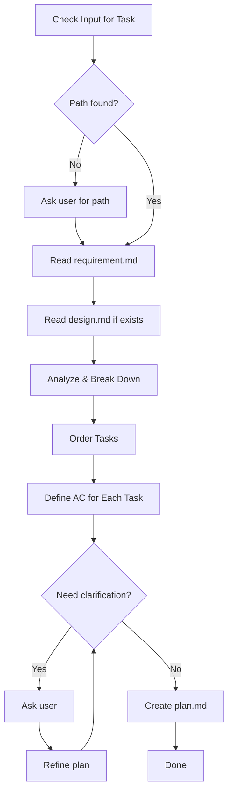

# Flower Plan

Create implementation plan with ordered tasks and acceptance criteria.

## Phase Constraints

This phase is **planning and documentation only**. The goal is to break down work into actionable tasks before starting.

### Allowed

- Read requirement and design documents
- Analyze scope and complexity
- Break down work into ordered tasks
- Define acceptance criteria for each task
- Identify dependencies and risks
- Create the `plan.md` document

### Not Allowed

- Writing, editing, or suggesting code changes
- Providing implementation code or snippets
- Making file changes of any kind (except `plan.md`)

### Why This Matters

Planning creates a roadmap. When you jump to code without a plan, you risk:

- Missing dependencies
- Forgetting edge cases
- Building in the wrong order
- Losing track of progress

A plan keeps implementation focused and measurable.

## Workflow



---

## Step 1: Get Task Path

Check user input for path, folder name, or partial match. Construct full path `.agents/flower/{folder-name}` and verify files exist. If not found, ask user.

---

## Step 2: Read Documents

Read `.agents/flower/{folder-name}/requirement.md`

Extract:

- Task type (feature/bug/improve/refactor/setup/explore)
- What needs to be built
- Acceptance criteria from requirement
- Constraints and scope

---

## Step 3: Read Design (if exists)

Check if `.agents/flower/{folder-name}/design.md` exists.

**If exists**, read and extract:

- Architecture decisions
- Implementation details
- Technical approach
- Key decisions to incorporate into plan

**If not exists**, proceed with requirement only.

---

## Step 4: Analyze & Break Down

### Understand the Scope

Based on requirement type and complexity:

| Type         | Typical Breakdown                                 |
| ------------ | ------------------------------------------------- |
| **feature**  | Setup → Core → Integration → Polish               |
| **bug**      | Investigate → Fix → Verify → Cleanup              |
| **improve**  | Baseline → Implement → Measure → Validate         |
| **refactor** | Setup → Migrate → Verify → Cleanup                |
| **setup**    | Prepare → Configure → Test → Document             |
| **explore**  | Define scope → Investigate → Document → Recommend |

### Break Down Principles

- **Atomic**: Each task should be completable in one session
- **Testable**: Each task has clear acceptance criteria
- **Ordered**: Dependencies are respected
- **Scoped**: Tasks align with requirement's AC

### Task Size Guidelines

| Task Type                     | Size      |
| ----------------------------- | --------- |
| Create single component       | 1 task    |
| Create component with tests   | 1-2 tasks |
| Add API endpoint              | 1 task    |
| Add API endpoint + DB changes | 2 tasks   |
| Fix bug                       | 1-2 tasks |
| Refactor module               | 1-2 tasks |

---

## Step 5: Order Tasks

### Ordering Rules

1. **Dependencies first**: Tasks that others depend on
2. **Foundation → Features**: Setup before implementation
3. **Core → Edge cases**: Main flow before edge cases
4. **Tests alongside**: Tests with their corresponding code

### Common Patterns

**Feature development:**

```
1. Setup (dependencies, config)
2. Data layer (models, DB)
3. Core logic (services)
4. API/UI layer
5. Tests
6. Polish (error handling, edge cases)
```

**Bug fix:**

```
1. Reproduce & confirm bug
2. Identify root cause
3. Implement fix
4. Add regression test
5. Verify fix
```

**Refactor:**

```
1. Ensure tests exist
2. Refactor step 1
3. Verify tests pass
4. Refactor step 2
5. Verify tests pass
6. Cleanup
```

---

## Step 6: Define AC for Each Task

### AC Format

Each task gets a specific acceptance criteria:

```
- [ ] 1.1 Create User model
  - AC: Model has name, email, password fields; validates email format
```

### AC Guidelines

- **Specific**: What exactly must work
- **Measurable**: Can be verified objectively
- **Testable**: Could write a test for it
- **Scoped**: Only what this task covers

### AC Sources

- From requirement's acceptance criteria
- From design's implementation details
- From task's inherent requirements

---

## Step 7: Clarify Loop

**Maximum 4 iterations.** Present plan and ask for feedback.

### How It Works

1. **Present**: Show the drafted plan
2. **Ask**: "Does this plan look good? Any tasks to add/remove/reorder?"
3. **Receive**: Get user feedback
4. **Refine**: Update plan based on feedback
5. **Repeat**: Ask again until approved or max iterations

### Question Guidelines

- Prefer closed questions (Yes/No, multiple choice) over open-ended
- One question at a time, or max 2-3 related questions together
- Use information from requirement and design to avoid asking what's already known
- Stop early if plan is approved

### Exit Conditions

Exit the loop and create plan.md when ANY of these is true:

| Condition                                        | Action                     |
| ------------------------------------------------ | -------------------------- |
| User approves plan                               | Proceed to create plan.md  |
| User confirms with "looks good", "proceed", "ok" | Proceed to create plan.md  |
| Iteration count = 4                              | Proceed with current draft |

---

## Step 8: Create plan.md

### Load Template

Read `assets/templates/plan.md`, fill all sections (title, createdAt, Overview, Task Breakdown with checkboxes + AC, Dependencies, Risks, Notes). Write to `.agents/flower/{folder-name}/plan.md`.

---

## Output

Inform user: file created, number of tasks and phases, summary of plan.
