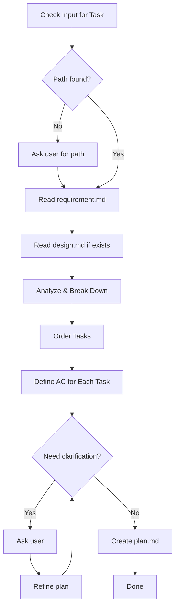

# Flower Plan

Create implementation plan with ordered tasks and acceptance criteria.

## Workflow



| Step | Action                  |
| ---- | ----------------------- |
| 1    | Get Task Path           |
| 2    | Read Requirement        |
| 3    | Read Design (if exists) |
| 4    | Analyze & Break Down    |
| 5    | Order Tasks             |
| 6    | Define AC for Each Task |
| 7    | Clarify Loop (max 4)    |
| 8    | Create plan.md          |

---

## Step 1: Get Task Path

**Check user input first.** Look for:

- Full path: `.agents/flower/250411-1430--add-dark-mode-toggle`
- Folder name: `250411-1430--add-dark-mode-toggle`
- Partial match: `dark-mode`, `add-dark-mode`

**If not found in input**, ask user:

> "Which task are you working on? Provide the folder name or path."
>
> Example: `250411-1430--add-dark-mode-toggle`

**After user provides:**

- Construct full path: `.agents/flower/{folder-name}`
- Verify `requirement.md` exists
- If not found, ask again

---

## Step 2: Read Requirement

Read `.agents/flower/{folder-name}/requirement.md`

Extract:

- Task type (feature/bug/improve/refactor/setup/explore)
- What needs to be built
- Acceptance criteria from requirement
- Constraints and scope

---

## Step 3: Read Design (if exists)

Check if `.agents/flower/{folder-name}/design.md` exists.

**If exists**, read and extract:

- Architecture decisions
- Implementation details
- Technical approach
- Key decisions to incorporate into plan

**If not exists**, proceed with requirement only.

---

## Step 4: Analyze & Break Down

### Understand the Scope

Based on requirement type and complexity:

| Type         | Typical Breakdown                                 |
| ------------ | ------------------------------------------------- |
| **feature**  | Setup → Core → Integration → Polish               |
| **bug**      | Investigate → Fix → Verify → Cleanup              |
| **improve**  | Baseline → Implement → Measure → Validate         |
| **refactor** | Setup → Migrate → Verify → Cleanup                |
| **setup**    | Prepare → Configure → Test → Document             |
| **explore**  | Define scope → Investigate → Document → Recommend |

### Break Down Principles

- **Atomic**: Each task should be completable in one session
- **Testable**: Each task has clear acceptance criteria
- **Ordered**: Dependencies are respected
- **Scoped**: Tasks align with requirement's AC

### Task Size Guidelines

| Task Type                     | Size      |
| ----------------------------- | --------- |
| Create single component       | 1 task    |
| Create component with tests   | 1-2 tasks |
| Add API endpoint              | 1 task    |
| Add API endpoint + DB changes | 2 tasks   |
| Fix bug                       | 1-2 tasks |
| Refactor module               | 1-2 tasks |

---

## Step 5: Order Tasks

### Ordering Rules

1. **Dependencies first**: Tasks that others depend on
2. **Foundation → Features**: Setup before implementation
3. **Core → Edge cases**: Main flow before edge cases
4. **Tests alongside**: Tests with their corresponding code

### Common Patterns

**Feature development:**

```
1. Setup (dependencies, config)
2. Data layer (models, DB)
3. Core logic (services)
4. API/UI layer
5. Tests
6. Polish (error handling, edge cases)
```

**Bug fix:**

```
1. Reproduce & confirm bug
2. Identify root cause
3. Implement fix
4. Add regression test
5. Verify fix
```

**Refactor:**

```
1. Ensure tests exist
2. Refactor step 1
3. Verify tests pass
4. Refactor step 2
5. Verify tests pass
6. Cleanup
```

---

## Step 6: Define AC for Each Task

### AC Format

Each task gets a specific acceptance criteria:

```
- [ ] 1.1 Create User model
  - AC: Model has name, email, password fields; validates email format
```

### AC Guidelines

- **Specific**: What exactly must work
- **Measurable**: Can be verified objectively
- **Testable**: Could write a test for it
- **Scoped**: Only what this task covers

### AC Sources

- From requirement's acceptance criteria
- From design's implementation details
- From task's inherent requirements

---

## Step 7: Clarify Loop

**Maximum 4 iterations.** Present plan and ask for feedback.

### How It Works

1. **Present**: Show the drafted plan
2. **Ask**: "Does this plan look good? Any tasks to add/remove/reorder?"
3. **Receive**: Get user feedback
4. **Refine**: Update plan based on feedback
5. **Repeat**: Ask again until approved or max iterations

### Example Questions

- "Should [task X] come before [task Y]?"
- "Is [granularity Z] appropriate, or should I split/merge?"
- "Any missing tasks for [requirement AC]?"

### Exit Conditions

- User approves plan
- User says "looks good", "proceed", "ok"
- Max 4 iterations reached

---

## Step 8: Create plan.md

### Load Template

Read `assets/templates/plan.md`

### Fill Content

1. Set `title` matching the requirement
2. Set `createdAt` to current datetime
3. Fill Overview with brief summary
4. Fill Task Breakdown with phases and tasks
5. Each task has checkbox + AC
6. Fill Dependencies if relevant
7. Fill Risks if relevant
8. Fill Notes if needed

### Write File

Create at: `.agents/flower/{folder-name}/plan.md`

---

## Output

Inform user:

- File created
- Number of tasks and phases
- Summary of plan

Example:

```
Created: .agents/flower/250411-1430--add-dark-mode-toggle/plan.md

Plan Summary:
- 3 phases, 8 tasks
- Phase 1: Setup (2 tasks)
- Phase 2: Core Implementation (4 tasks)
- Phase 3: Testing & Polish (2 tasks)

Ready to implement. Start with task 1.1
```

---

## Template

Located at `assets/templates/plan.md`:
