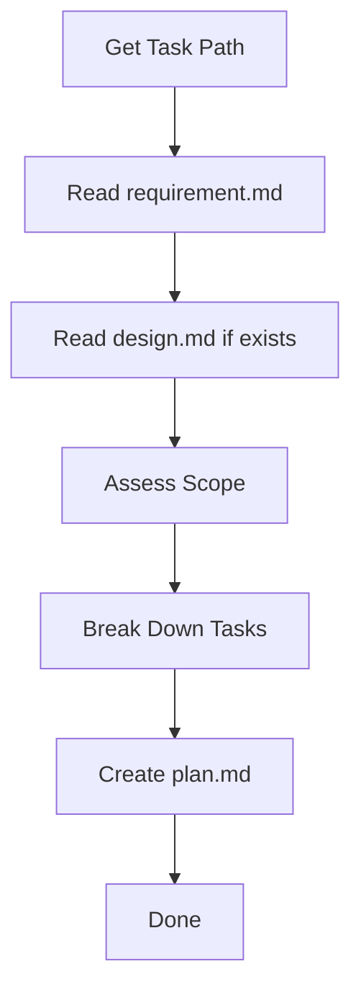

Create implementation plan from requirements and design.

## Core Principle

This phase is **planning and sequencing only**. Focus on **what work to do, in what order**, and **how to verify each piece**. Do not design new architecture or rewrite requirements — translate existing inputs into actionable, verifiable tasks.

A good plan turns ambiguity into a checklist. Each task must be small enough to implement in one focused session and have clear acceptance criteria.

## Workflow

| Step | Action           | Output                                  |
| ---- | ---------------- | --------------------------------------- |
| 1    | Get Task Path    | Folder path under `.agents/flower/`     |
| 2    | Read Inputs      | Understand requirements and design      |
| 3    | Assess Scope     | Decide number of phases and granularity |
| 4    | Break Down Tasks | Ordered tasks with independent AC       |
| 5    | Create plan.md   | `.agents/flower/{folder}/plan.md`       |

---

## Step 1: Get Task Path

Check user input for path, folder name, or partial match. Construct full path `.agents/flower/{folder-name}` and verify files exist. If not found, ask user.

---

## Step 2: Read Inputs

Read the following files from the task folder:

1. **requirement.md** — mandatory
2. **design.md** — if it exists

Extract:

- Task type (feature/bug/improve/refactor/setup/explore)
- What needs to be built or changed
- Acceptance criteria from requirements
- Constraints, non-goals, and dependencies
- Technical approach from design (if available)
- Files, modules, or APIs mentioned

If **design.md is missing**, plan directly from `requirement.md`. Do not go back to create design.md.

---

## Step 3: Assess Scope

Determine the right level of granularity:

| Scope Indicator                              | Suggested Granularity |
| -------------------------------------------- | --------------------- |
| ≤ 2 files, trivial change                    | 1 phase, 1–3 tasks    |
| 3–6 files, medium complexity                 | 2 phases, 4–6 tasks   |
| 7+ files, cross-cutting, or new architecture | 3+ phases, 7–10 tasks |

Group tasks into phases that reflect a natural implementation order (e.g., setup → core → integration → polish).

---

## Step 4: Break Down Tasks

Create ordered, independently verifiable tasks.

### Task Structure

Each task must have:

- **Numbering** — `Phase.Task` format (e.g., `1.1`, `1.2`, `2.1`)
- **Action-oriented description** — start with a verb (e.g., "Add", "Refactor", "Update", "Write tests for")
- **Single acceptance criterion** — one concrete, verifiable outcome prefixed with `AC:`

### Rules for Good Tasks

- **One concern per task** — do not combine "implement + test + document" into one task
- **Independent AC** — the AC should be checkable without finishing later tasks
- **Logical order** — downstream tasks depend on upstream tasks being complete
- **No design decisions** — assume design is already resolved; focus on execution

### Common Task Patterns

| Type     | Typical Task Sequence                                            |
| -------- | ---------------------------------------------------------------- |
| Feature  | setup → types/schema → core logic → API/UI wiring → tests → docs |
| Bug      | reproduce → fix → add regression test → verify                   |
| Refactor | map usages → migrate code → update tests → remove dead code      |
| Setup    | install dependency → configure → verify in one consumer          |

---

## Step 5: Create plan.md

1. Read template from `assets/templates/plan.md`
2. Fill all sections based on the task breakdown
3. Set `createdAt` (YYYY-MM-DD HH:MM) and `title` (from requirement)
4. Write to `.agents/flower/{folder-name}/plan.md`

---

## Output

Inform user:

- File path
- Number of phases and tasks
- Any high-risk or blocking tasks noted
- Next step suggestion (implement phase)
