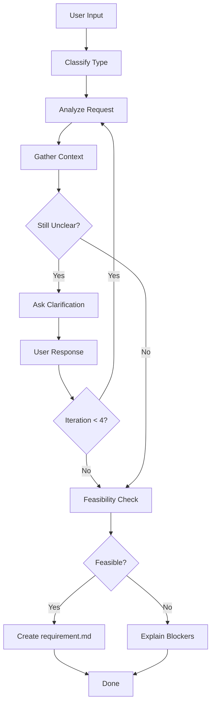

# Flower Propose

Transform user input into a structured requirement document.

## Workflow



| Step | Action         | Output                                             |
| ---- | -------------- | -------------------------------------------------- |
| 1    | Classify       | Type: feature/bug/improve/refactor/setup/explore   |
| 2    | Analyze        | What, Why, Who, Context                            |
| 3    | Gather Context | Codebase findings, Web research                    |
| 4    | Clarify Loop   | Max 4 iterations, closed questions                 |
| 5    | Feasibility    | Technical/Scope/Dependencies check                 |
| 6    | Create         | `.agents/flower/{datetime}--{desc}/requirement.md` |

---

## Step 1: Classify Request Type

Identify the type based on user intent:

| Type       | Keywords                                              | Description                   |
| ---------- | ----------------------------------------------------- | ----------------------------- |
| `feature`  | add, new, implement, create                           | Add new capability            |
| `bug`      | fix, bug, error, broken, crash                        | Fix incorrect behavior        |
| `improve`  | improve, faster, better, optimize, enhance            | Improve existing (not broken) |
| `refactor` | refactor, clean up, reorganize, rename                | Change code, keep behavior    |
| `setup`    | setup, configure, install, initialize, add dependency | Infrastructure/config         |
| `explore`  | how, why, what, research, investigate                 | Question/investigation        |

**Decision rule**: When uncertain, ask: "Is the user asking me to implement something, or just understand something?"

- Implement → feature/bug/improve/refactor/setup
- Understand → explore

---

## Step 2: Analyze User Request

Extract and understand:

- **What**: The core request
- **Why**: The motivation/problem
- **Who**: Affected users/stakeholders
- **Context**: Related features, current state

If the request is vague, note specific gaps to address in clarification.

---

## Step 3: Gather Context

### Codebase Search

Use available tools to search for:

- Related existing code (Grep for keywords)
- Similar features/patterns (Glob for file patterns)
- Dependencies and integrations (check imports, configs)

### Web Search (if applicable)

Search for:

- Best practices for this type of task
- Library/framework documentation
- Similar implementations or patterns

Document findings briefly. If no relevant context found, note "No existing context found."

---

## Step 4: Clarify Loop

**Maximum 4 iterations.** Each iteration: Ask → Receive → Analyze Again.

The loop works as follows:

1. **Assess**: Determine if requirement is clear enough to proceed
2. **Ask**: If unclear, ask ONE targeted question (or max 2-3 related)
3. **Receive**: Get user's response
4. **Analyze Again**: Incorporate new information, update What/Why/Who/Context
5. **Repeat**: Assess again, exit when clear or max iterations reached

### Question Guidelines

- Prefer closed questions (Yes/No, multiple choice) over open-ended
- One question at a time, or max 2-3 related questions together
- Use information from context gathering to avoid asking what's already known
- Stop early if requirement is clear

### Example Questions by Type

**feature**:

- "Should this be available to all users or specific roles?"
- "What happens when [edge case]?"
- "Is this blocking or non-blocking?"

**bug**:

- "Does this happen consistently or intermittently?"
- "When did this start happening?"
- "What's the impact: low/medium/high?"

**improve**:

- "What metric should improve? (e.g., load time, memory, UX)"
- "Is backward compatibility required?"

**refactor**:

- "What's triggering this refactor? (tech debt, performance, readability)"
- "Are there any behavioral changes, even minor ones?"

**setup**:

- "Is this for development or production?"
- "Any specific version requirements?"

**explore**:

- "What decision depends on this investigation?"
- "How much time should we spend?"

### Exit Conditions

Exit the loop and proceed to Feasibility when ANY of these is true:

- Requirement is clear enough
- User says "proceed", "that's all", "good enough"
- Iteration count = 4 (proceed with best understanding)
- User asks to stop

---

## Step 5: Feasibility Check

Perform a quick assessment:

| Check            | Questions                                          | If Blocked                          |
| ---------------- | -------------------------------------------------- | ----------------------------------- |
| **Technical**    | Can this be done with current stack? Any blockers? | Explain why, suggest alternatives   |
| **Scope**        | Is this realistic for one session? Need to split?  | Suggest breaking into smaller tasks |
| **Dependencies** | Any external blockers? API access, services?       | List blockers, do NOT create file   |

**Outcome**:

- **Feasible** → Proceed to Step 6
- **Not feasible** → Explain blockers to user, do NOT create requirement.md

---

## Step 6: Create requirement.md

### Folder Name Format

`{YYMMDD-HHMM}--{short-desc}`

Example: `250411-1430--add-user-auth`

### Template Selection

Load the appropriate template from `assets/templates/{type}.md`:

| Type     | Template      |
| -------- | ------------- |
| feature  | `feature.md`  |
| bug      | `bug.md`      |
| improve  | `improve.md`  |
| refactor | `refactor.md` |
| setup    | `setup.md`    |
| explore  | `explore.md`  |

### Fill Template

1. Read the template file
2. Fill in sections based on gathered information
3. Set `createdAt` to current datetime (YYYY-MM-DD HH:MM)
4. Set `title` to a clear, concise summary

### Output Location

Create the file at `.agents/flower/{folder-name}/requirement.md`

---

## Output

After creating the file, inform the user:

- The created file path
- A brief summary of what was captured
- The classified type

Example:

```
Created: .agents/flower/250411-1430--add-user-auth/requirement.md

Type: feature
Summary: Add JWT-based user authentication with role-based access control

Next: Run /flower:design to create technical design
```

---

## Templates

Located in `assets/templates/`:

- `feature.md` - New capabilities
- `bug.md` - Bug fixes
- `improve.md` - Improvements
- `refactor.md` - Code refactoring
- `setup.md` - Setup/configuration
- `explore.md` - Investigations
