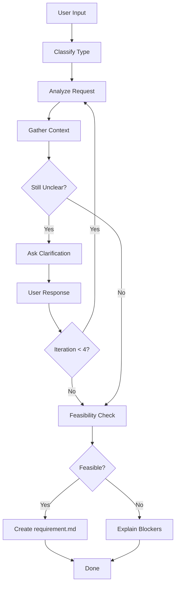

# Flower Propose

Transform user input into a structured requirement document.

## Phase Constraints

This phase is **research, exploration, and clarification only**. The goal is to understand the problem before solving it.

### Allowed

- Read and search the codebase (Grep, Glob, View)
- Research documentation and best practices
- Ask clarifying questions
- Describe findings in prose
- Identify patterns, dependencies, constraints
- Create the `requirement.md` document

### Not Allowed

- Writing, editing, or suggesting code changes
- Providing code snippets, diffs, or pseudocode
- Offering implementation hints ("you could do X by...")
- Making file changes of any kind (except `requirement.md`)

### Why This Matters

Good requirements come from understanding, not jumping to solutions. If you provide code during this phase, you short-circuit the design and planning phases that should shape the implementation.

## Workflow

| Step | Action         | Output                                             |
| ---- | -------------- | -------------------------------------------------- |
| 1    | Classify       | Type: feature/bug/improve/refactor/setup/explore   |
| 2    | Analyze        | What, Why, Who, Context                            |
| 3    | Gather Context | Codebase findings, Web research                    |
| 4    | Clarify Loop   | Max 4 iterations, closed questions                 |
| 5    | Feasibility    | Technical/Scope/Dependencies check                 |
| 6    | Create         | `.agents/flower/{datetime}--{desc}/requirement.md` |

---

## Step 1: Classify Request Type

Identify the type based on user intent:

| Type       | Keywords                                              | Description                   |
| ---------- | ----------------------------------------------------- | ----------------------------- |
| `feature`  | add, new, implement, create                           | Add new capability            |
| `bug`      | fix, bug, error, broken, crash                        | Fix incorrect behavior        |
| `improve`  | improve, faster, better, optimize, enhance            | Improve existing (not broken) |
| `refactor` | refactor, clean up, reorganize, rename                | Change code, keep behavior    |
| `setup`    | setup, configure, install, initialize, add dependency | Infrastructure/config         |
| `explore`  | how, why, what, research, investigate                 | Question/investigation        |

**Decision rule**: When uncertain, ask: "Is the user asking me to implement something, or just understand something?"

- Implement → feature/bug/improve/refactor/setup
- Understand → explore

---

## Step 2: Analyze User Request

Extract and understand:

- **What**: The core request
- **Why**: The motivation/problem
- **Who**: Affected users/stakeholders
- **Context**: Related features, current state

If the request is vague, note specific gaps to address in clarification.

---

## Step 3: Gather Context

### Explore Codebase

Use available tools to search for:

- Related existing code (Grep for keywords)
- Similar features/patterns (Glob for file patterns)
- Dependencies and integrations (check imports, configs)

### Explore Web (if applicable)

Search for:

- Best practices for this type of task
- Library/framework documentation
- Similar implementations or patterns

Document findings briefly. If no relevant context found, note "No existing context found."

---

## Step 4: Clarify Loop

**Maximum 4 iterations.** Present requirement and ask for feedback.

### How It Works

1. **Present**: Show the drafted requirement
2. **Ask**: "Does this requirement look clear? Any missing details?"
3. **Receive**: Get user feedback
4. **Refine**: Update requirement based on feedback
5. **Repeat**: Ask again until approved or max iterations

### Question Guidelines

- Prefer closed questions (Yes/No, multiple choice) over open-ended
- Provide options when possible (e.g., "Impact: low/medium/high?")
- One question at a time, or max 2-3 related questions
- Use context from exploration to avoid asking known info
- Stop early if requirement is clear

### Exit Conditions

Exit the loop and proceed to Feasibility when ANY of these is true:

| Condition                 | Action                          |
| ------------------------- | ------------------------------- |
| User approves requirement | Proceed to Feasibility Check    |
| Iteration count = 4       | Proceed with best understanding |

---

## Step 5: Feasibility Check

Perform a quick assessment:

| Check            | Questions                                          | If Blocked                          |
| ---------------- | -------------------------------------------------- | ----------------------------------- |
| **Technical**    | Can this be done with current stack? Any blockers? | Explain why, suggest alternatives   |
| **Scope**        | Is this realistic for one session? Need to split?  | Suggest breaking into smaller tasks |
| **Dependencies** | Any external blockers? API access, services?       | List blockers, do NOT create file   |

**Outcome**:

- **Feasible** → Proceed to Step 6
- **Not feasible** → Explain blockers to user, do NOT create requirement.md

---

## Step 6: Create requirement.md

1. Read template from `assets/templates/{type}.md` (feature/bug/improve/refactor/setup/explore)
2. Fill sections based on gathered information
3. Set `createdAt` (YYYY-MM-DD HH:MM) and `title`
4. Write to `.agents/flower/{YYMMDD-HHMM}--{short-desc}/requirement.md`

---

## Output

Inform user: file path, classified type, brief summary.
