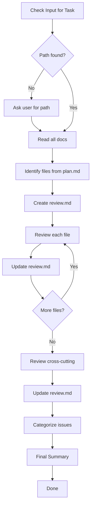

# Flower Review

Review code quality and security after verification.

## Workflow



| Step | Action                        |
| ---- | ----------------------------- |
| 1    | Get Task Path                 |
| 2    | Read All Documents            |
| 3    | Identify Files to Review      |
| 4    | Create review.md              |
| 5    | Review Files One-by-One       |
| 6    | Update review.md (MANDATORY)  |
| 7    | Review Cross-Cutting Concerns |
| 8    | Update review.md (MANDATORY)  |
| 9    | Categorize Issues             |
| 10   | Final Summary                 |

---

## Step 1: Get Task Path

Check user input for path, folder name, or partial match. Construct full path `.agents/flower/{folder-name}` and verify files exist. If not found, ask user.

---

## Step 2: Read Documents

### Read Order

1. **requirement.md** - Understand what was built
2. **design.md** (if exists) - Understand architecture decisions
3. **plan.md** - Identify files created/modified
4. **verify.md** (if exists) - See verification results

### Extract Information

Understand context before reviewing:

- What features were implemented
- What decisions were made
- What files changed

---

## Step 3: Identify Files to Review

### From plan.md

Extract file list from plan.md:

- Files explicitly mentioned in tasks
- Files created (new)
- Files modified (existing)

### From Git (Optional)

If available, use git to identify changed files:

```bash
git diff --name-only HEAD~1
```

### Create File List

List all files to review:

```
Files to review:
- src/components/ThemeToggle.tsx (new)
- src/contexts/ThemeContext.tsx (new)
- src/styles/globals.css (modified)
```

---

## Step 4: Create review.md

Read `assets/templates/review.md`, fill sections (title, createdAt, list files to review, keep checks as pending). Write to `.agents/flower/{folder-name}/review.md`.

---

## Step 5: Review Files One-by-One

**For each file, perform quality and security review.**

### Quality Review (per file)

#### DRY (Don't Repeat Yourself)

Check for:

- Duplicate code blocks in this file
- Similar logic that could be extracted
- Copy-pasted patterns from other files

**How to check:**

- Read file for repeated patterns
- Search codebase for similar code
- Compare with other modified files

**Flag if:**

- Same logic appears 2+ times
- Similar functions in different files
- Copy-pasted code without abstraction

#### YAGNI (You Aren't Gonna Need It)

Check for:

- Unused code in this file
- Over-engineering
- Features not in requirement/design

**How to check:**

- Check if all code is used
- Verify against requirement scope
- Look for premature abstractions

**Flag if:**

- Commented-out code
- Unused functions/variables/imports
- Complex abstractions for simple needs

#### KISS (Keep It Simple)

Check for:

- Overly complex solutions
- Unnecessary abstractions
- Hard-to-understand code

**How to check:**

- Read code for clarity
- Count nesting levels
- Check function complexity

**Flag if:**

- Deep nesting (>3 levels)
- Long functions (>30 lines)
- Over-engineered patterns

#### Clean Code

Check for:

**Naming:**

- Variable names are meaningful
- Function names describe action
- No cryptic abbreviations

**Functions:**

- Functions are small (<20 lines ideal)
- Functions do one thing
- Clear purpose

**Structure:**

- Clear code flow
- Readable formatting
- Logical organization

### Security Review (per file)

#### Input Validation

Check for:

- User inputs validated
- Type checking done
- Boundary checks exist

**Common issues:**

- Missing validation on user inputs
- Trust of external data
- Missing type checks

#### Sensitive Data

Check for:

- No hardcoded secrets (API keys, passwords)
- Secrets in environment variables
- Sensitive data not in logs

**Common issues:**

- Hardcoded API keys
- Passwords in code
- Sensitive data logged

#### Authentication & Authorization

Check for:

- Auth checks on protected routes
- Proper session handling
- Role-based access if needed

**Common issues:**

- Missing auth checks
- Insecure session handling
- Improper access control

#### Common Vulnerabilities

**SQL Injection:**

- Parameterized queries used
- No string concatenation in SQL

**XSS (Cross-Site Scripting):**

- Output is escaped
- No raw HTML insertion

**CSRF (Cross-Site Request Forgery):**

- CSRF tokens used
- Proper request validation

---

## Step 6: Update review.md (MANDATORY)

**This step is mandatory after reviewing each file.**

Update `.agents/flower/{folder-name}/review.md` matching template format:

**Passed:**

```markdown
- [x] Check name
  - Status: passed
  - Notes: description
```

**Failed:**

```markdown
- [x] Check name
  - Status: failed
  - Notes: reason + recommendation
```

Add issues to Issues section, replacing "None" with:

```markdown
### CRITICAL

- **file:line** - Issue description
  - Fix: recommended fix
```

---

## Step 7: Review Cross-Cutting Concerns

After reviewing all files, check project-wide concerns:

### Naming Consistency

Check across all modified files:

- Consistent naming style (camelCase, PascalCase)
- Consistent file naming
- Consistent folder structure

### Project Conventions

Check if code follows:

- Existing code patterns
- Import organization
- Code style (formatting, indentation)

### Documentation

Check if:

- Comments added for complex logic
- README updated if needed
- API docs updated if endpoints changed

### Tests

Check if:

- Unit tests exist for new functions
- Integration tests for features
- Test coverage adequate

---

## Step 8: Update review.md (MANDATORY)

**This step is mandatory after cross-cutting review.**

### Update Cross-Cutting Section

Fill cross-cutting concerns section with:

- Naming consistency results
- Convention adherence results
- Documentation status
- Test coverage status

---

## Step 9: Categorize Issues

### Severity Levels

| Level      | Meaning                    | When to Use                             |
| ---------- | -------------------------- | --------------------------------------- |
| CRITICAL   | Must fix before proceeding | Security vulnerabilities, critical bugs |
| WARNING    | Should fix                 | Quality issues, missing tests           |
| SUGGESTION | Optional improvements      | Minor refactoring opportunities         |

### Categorization Rules

**CRITICAL:**

- Hardcoded secrets
- Authentication bypasses
- SQL injection risks
- XSS vulnerabilities
- Critical logic errors

**WARNING:**

- Duplicate code (significant)
- Missing tests for core features
- Missing input validation
- Complex code that needs simplification

**SUGGESTION:**

- Minor naming improvements
- Small refactoring opportunities
- Optional documentation
- Non-critical clean code suggestions

---

## Step 10: Final Summary

### Calculate Summary

| Category      | CRITICAL | WARNING | SUGGESTION |
| ------------- | -------- | ------- | ---------- |
| Quality       | --       | --      | --         |
| Security      | --       | --      | --         |
| Cross-cutting | --       | --      | --         |

### Determine Recommendation

**If CRITICAL issues found:**

```
REVIEW FAILED

Critical issues:
- [list critical issues]
```

**If only WARNING/SUGGESTION:**

```
REVIEW PASSED (with notes)

Warnings:
- [list warnings]

Suggestions:
- [list suggestions]
```

**If all pass:**

```
REVIEW PASSED

No issues found. Code quality and security checks passed.
```

### Update review.md Summary

1. Fill summary table
2. List all issues by severity
3. Update sign-off section

### Report to User

```
Review Complete: .agents/flower/{folder-name}/review.md

Files reviewed: X

Summary:
| Category      | CRITICAL | WARNING | SUGGESTION |
|---------------|----------|-----------|--------------|
| Quality       | X        | Y         | Z            |
| Security      | X        | Y         | Z            |
| Cross-cutting | X        | Y         | Z            |

```

---

## Output

Inform user: file location, summary table, issues by severity.
