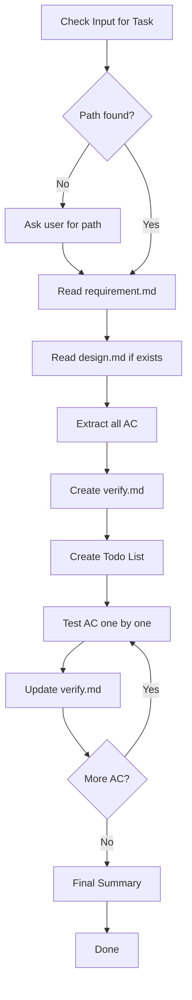

# Flower Verify

Verify implementation against acceptance criteria.

## Workflow



| Step | Action                       |
| ---- | ---------------------------- |
| 1    | Get Task Path                |
| 2    | Read Requirement & Design    |
| 3    | Extract Acceptance Criteria  |
| 4    | Create verify.md             |
| 5    | Create Todo List             |
| 6    | Test Each AC                 |
| 7    | Update verify.md (MANDATORY) |
| 8    | Final Summary                |

---

## Step 1: Get Task Path

**Check user input first.** Look for:

- Full path: `.agents/flower/250411-1430--add-dark-mode-toggle`
- Folder name: `250411-1430--add-dark-mode-toggle`
- Partial match: `dark-mode`, `add-dark-mode`

**If not found in input**, ask user:

> "Which task are you working on? Provide the folder name or path."
>
> Example: `250411-1430--add-dark-mode-toggle`

**After user provides:**

- Construct full path: `.agents/flower/{folder-name}`
- Verify `requirement.md` exists
- If not found, ask again

---

## Step 2: Read Requirement & Design

### Read Requirement

Read `.agents/flower/{folder-name}/requirement.md`

Extract:

- All acceptance criteria listed
- Task type
- Scope and constraints

### Read Design (if exists)

Read `.agents/flower/{folder-name}/design.md` if present.

Extract:

- Key decisions that need verification
- Implementation details to check
- Any specific test scenarios

---

## Step 3: Extract Acceptance Criteria

### From Requirement

Look for sections like:

- "Acceptance Criteria" with checkboxes
- "AC1:", "AC2:", etc.
- Success criteria

### From Design

Look for:

- Key decisions that should be reflected in code
- Implementation details mentioned
- Specific behaviors described

### Combine into Test List

Create a unified list of all items to verify:

- AC from requirement (mandatory)
- Design decisions (if design exists)
- Edge cases mentioned

---

## Step 4: Create verify.md

### Load Template

Read `assets/templates/verify.md`

### Fill Content

1. Set `title` matching the requirement
2. Set `createdAt` to current datetime
3. List all AC from requirement under "From Requirement"
4. List design criteria under "From Design" (if applicable)
5. Set all status to `pending`
6. Leave notes empty

### Write File

Create at: `.agents/flower/{folder-name}/verify.md`

---

## Step 5: Create Todo List

Use the `todos` tool to track testing progress.

Create one todo item for each acceptance criteria:

```
- Test AC1: [description] (pending)
- Test AC2: [description] (pending)
- Test DC1: [design criteria] (pending)
```

Mark first item as `in_progress` before testing.

---

## Step 6: Test Each AC

### Testing Approach

For each acceptance criteria, determine how to test:

| AC Type         | Testing Method                |
| --------------- | ----------------------------- |
| UI behavior     | Run app, manually test        |
| API response    | Make API call, check response |
| Data validation | Test with valid/invalid data  |
| Error handling  | Trigger error, check handling |
| Performance     | Measure and compare           |
| Integration     | Test with external systems    |

### Testing Process

For each AC:

1. **Mark as in_progress** in todo list
2. **Perform test** - run code, make requests, check behavior
3. **Document result** - passed, failed, or issues found
4. **Update verify.md** (MANDATORY - see Step 7)
5. **Mark as completed** in todo list
6. **Move to next AC**

### Test Documentation

For each test, note:

- What was tested
- How it was tested
- Result (passed/failed)
- Any issues or observations

---

## Step 7: Update verify.md (MANDATORY)

**This step is mandatory after each test. Never skip.**

### After Each Test

Immediately update `.agents/flower/{folder-name}/verify.md`:

1. Find the corresponding AC in the file
2. Update checkbox: `[ ]` → `[x]` if passed
3. Update status: `pending` → `passed` or `failed`
4. Add notes: What was tested, result, any observations

### Example Update

Before:

```markdown
- [ ] AC1: User can toggle dark mode
  - Status: pending
  - Notes:
```

After (passed):

```markdown
- [x] AC1: User can toggle dark mode
  - Status: passed
  - Notes: Clicked toggle, theme changed immediately. Tested in Chrome and Firefox.
```

After (failed):

```markdown
- [ ] AC1: User can toggle dark mode
  - Status: failed
  - Notes: Toggle click not responding. Button event listener not attached.
```

### Why Mandatory

- Ensures verification progress is tracked
- Provides audit trail of testing
- Prevents skipping tests
- Documents issues found

---

## Step 8: Final Summary

After all ACs tested:

### Update verify.md Summary

1. Count passed vs failed
2. List issues found
3. Update sign-off section

### Report to User

Inform user:

- Total ACs tested
- Pass count
- Fail count
- Issues found
- Recommendation

Example:

```
Verification Complete: .agents/flower/250411-1430--add-dark-mode-toggle/verify.md

Results:
- Total: 8 acceptance criteria
- Passed: 6
- Failed: 2

Issues Found:
1. AC3: Toggle state not persisted on refresh
2. AC7: Transition not smooth on Safari

Recommendation: Fix issues before marking complete.
```

---

## Output

After completion, inform user:

- File location
- Test results summary
- Issues found (if any)
- Next steps recommendation

---

## Template

Located at `assets/templates/verify.md`:
