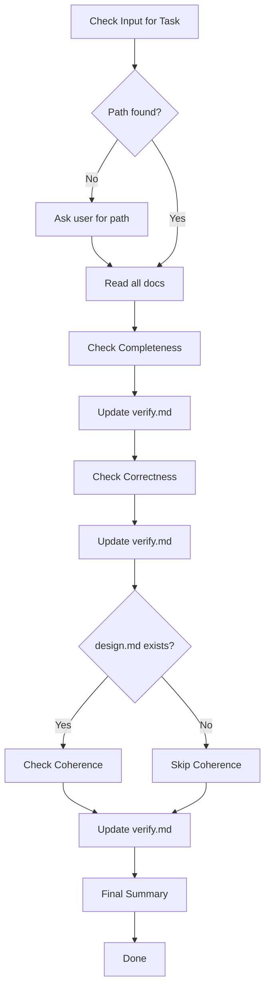

# Flower Verify

Verify implementation is complete, correct, and coherent.

## Workflow



|     | Step                         | Action |
| --- | ---------------------------- | ------ |
| 1   | Get Task Path                |
| 2   | Read All Documents           |
| 3   | Check Completeness           |
| 4   | Update verify.md (MANDATORY) |
| 5   | Check Correctness            |
| 6   | Update verify.md (MANDATORY) |
| 7   | Check Coherence (if design)  |
| 8   | Update verify.md (MANDATORY) |
| 9   | Final Summary                |

---

## Step 1: Get Task Path

**Check user input first.** Look for:

- Full path: `.agents/flower/250411-1430--add-dark-mode-toggle`
- Folder name: `250411-1430--add-dark-mode-toggle`
- Partial match: `dark-mode`, `add-dark-mode`

**If not found in input**, ask user:

> "Which task are you working on? Provide the folder name or path."
>
> Example: `250411-1430--add-dark-mode-toggle`

**After user provides:**

- Construct full path: `.agents/flower/{folder-name}`
- Verify `requirement.md` exists
- If not found, ask again

---

## Step 2: Read All Documents

### Read Order

1. **requirement.md** - Understand what to build
2. **design.md** (if exists) - Understand how to build
3. **plan.md** - See task breakdown

### Extract Information

**From requirement.md:**

- Task type
- All acceptance criteria
- Scope and constraints

**From design.md (if exists):**

- Key decisions
- Architecture choices
- Implementation details

**From plan.md:**

- All tasks with checkboxes
- Task breakdown structure

---

## Step 3: Check Completeness

**Question:** Are all tasks from plan.md complete?

### Count Tasks

Read plan.md and count:

- Tasks marked `- [x]` (complete)
- Tasks marked `- [ ]` (incomplete)

### Report Completion

If all tasks complete:

```
Completeness: N/N tasks complete ✓
```

If incomplete tasks found:

```
Completeness: X/N tasks complete ⚠️

Incomplete tasks:
- [ ] Task 1.2: Create component
- [ ] Task 3.1: Add tests
```

### Issue Level

- All complete → Pass
- Some incomplete → **WARNING** (if minor) or **CRITICAL** (if core tasks missing)

---

## Step 4: Update verify.md (MANDATORY)

**This step is mandatory after completeness check. Never skip.**

### Create verify.md

If not exists, read template from `assets/templates/verify.md` and create:

`.agents/flower/{folder-name}/verify.md`

### Update Completeness Section

Fill the Completeness section with:

- Task count
- Completion percentage
- List of incomplete tasks (if any)
- Issue level (pass/warning/critical)

---

## Step 5: Check Correctness

**Question:** Does implementation satisfy all acceptance criteria?

### Extract AC from requirement.md

Look for:

- "Acceptance Criteria" section
- "AC1:", "AC2:", etc.
- Success criteria checkboxes

### Test Each AC

For each acceptance criteria:

1. **Identify test method** based on AC type:

   | AC Type         | Testing Method                |
   | --------------- | ----------------------------- |
   | UI behavior     | Run app, manually test        |
   | API response    | Make API call, check response |
   | Data validation | Test with valid/invalid data  |
   | Error handling  | Trigger error, check handling |
   | Performance     | Measure and compare           |
   | Integration     | Test with external systems    |

2. **Perform test**
3. **Document result**
4. **Continue to next AC**

### Report Correctness

For each AC, report:

- Status: passed / failed
- Evidence: What was tested, how
- Files: Which files implement this AC

### Issue Level

- All passed → Pass
- Some failed → **CRITICAL** (AC not satisfied)

---

## Step 6: Update verify.md (MANDATORY)

**This step is mandatory after each AC test. Never skip.**

### Update Correctness Section

For each AC tested, update verify.md:

```markdown
- [x] AC1: User can toggle dark mode
  - Status: passed
  - Method: Manual UI test
  - Files: src/components/ThemeToggle.tsx
  - Notes: Clicked toggle, theme changed. Tested Chrome/Firefox.
```

Or if failed:

```markdown
- [ ] AC3: Theme persists on refresh
  - Status: failed
  - Method: Manual UI test
  - Files: src/contexts/ThemeContext.tsx
  - Notes: Theme resets to default on page refresh. localStorage not being read.
```

---

## Step 7: Check Coherence (if design.md exists)

**Question:** Does implementation follow design decisions?

**Skip this step if design.md does not exist.**

### Extract Design Decisions

From design.md, extract:

- Key decisions (e.g., "Use React Context for state")
- Architecture choices (e.g., "CSS variables for theming")
- Implementation details (e.g., "Store preference in localStorage")

### Verify Each Decision

For each design decision:

1. **Search codebase** for implementation
2. **Check if decision is followed**
3. **Document evidence**

### Report Coherence

For each decision:

```markdown
- [x] Use React Context for theme state
  - Status: followed
  - Evidence: src/contexts/ThemeContext.tsx implements Context API
```

If violated:

```markdown
- [ ] Store preference in localStorage
  - Status: violated
  - Expected: localStorage.setItem/getItem calls
  - Found: No localStorage usage
  - Recommendation: Implement localStorage persistence or update design.md
```

### Check Code Pattern Consistency

Check if new code follows existing project patterns:

- Naming conventions
- File structure
- Import patterns
- Code style

### Issue Level

- All followed → Pass
- Some violated → **WARNING** (design mismatch)
- Pattern inconsistencies → **SUGGESTION**

---

## Step 8: Update verify.md (MANDATORY)

**This step is mandatory after coherence check. Never skip.**

### Update Coherence Section

Fill the Coherence section with:

- Design decisions check results
- Pattern consistency findings
- Issue level for each finding

---

## Step 9: Final Summary

### Calculate Overall Status

| Dimension    | Status                      |
| ------------ | --------------------------- |
| Completeness | Pass / WARNING / CRITICAL   |
| Correctness  | Pass / CRITICAL             |
| Coherence    | Pass / WARNING / SUGGESTION |

### Determine Recommendation

**If CRITICAL issues found:**

```
VERIFICATION FAILED

Critical issues:
- [list critical issues]

Fix before proceeding to review.
```

**If only WARNING/SUGGESTION:**

```
VERIFICATION PASSED (with notes)

Warnings:
- [list warnings]

Suggestions:
- [list suggestions]

Ready for review (consider addressing warnings).
```

**If all pass:**

```
VERIFICATION PASSED

All checks passed. Ready for review.
```

### Update verify.md Summary

1. Fill summary section with overall status
2. List all issues categorized by level
3. Update sign-off section

### Report to User

```
Verification Complete: .agents/flower/{folder-name}/verify.md

Summary:
| Dimension    | Status      |
|--------------|-------------|
| Completeness | N/N tasks   |
| Correctness  | X/Y ACs     |
| Coherence    | Followed    |

Issues: [count] CRITICAL, [count] WARNING, [count] SUGGESTION

Recommendation: [recommendation]
```

---

## Issue Levels

| Level      | Meaning                    | Action                           |
| ---------- | -------------------------- | -------------------------------- |
| CRITICAL   | Must fix before proceeding | Stop, fix immediately            |
| WARNING    | Should fix                 | Fix if possible, document reason |
| SUGGESTION | Nice to fix                | Optional, can skip               |

---

## Output

After completion, inform user:

- File location
- Summary table
- Issue count by level
- Recommendation

---

## Template

Located at `assets/templates/verify.md`.
