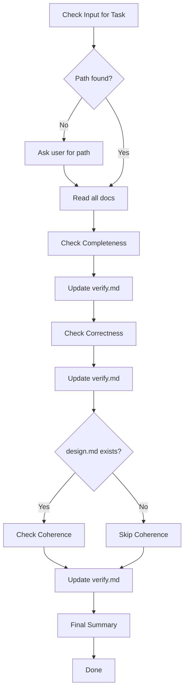

# Flower Verify

Verify implementation is complete, correct, and coherent.

## Phase Constraints

This phase is **verification and documentation only**. The goal is to assess, not fix.

### Allowed

- Read and analyze all documents and code
- Run tests and inspect implementation
- Create and update `verify.md`

### Not Allowed

- Modifying implementation code
- Fixing bugs (document them instead)
- Making file changes (except `verify.md`)

### Why This Matters

Verification validates that what was built matches what was planned. By keeping verification separate from fixes, you create a clear audit trail and avoid introducing new issues while fixing old ones.

## Workflow



---

## Step 1: Get Task Path

Check user input for path, folder name, or partial match. Construct full path `.agents/flower/{folder-name}` and verify files exist. If not found, ask user.

---

## Step 2: Read Documents

### Read Order

1. **requirement.md** - Understand what to build
2. **design.md** (if exists) - Understand how to build
3. **plan.md** - See task breakdown

### Extract Information

**From requirement.md:**

- Task type
- All acceptance criteria
- Scope and constraints

**From design.md (if exists):**

- Key decisions
- Architecture choices
- Implementation details

**From plan.md:**

- All tasks with checkboxes
- Task breakdown structure

---

## Step 3: Check Completeness

**Question:** Are all tasks from plan.md complete?

### Count Tasks

Read plan.md and count:

- Tasks marked `- [x]` (complete)
- Tasks marked `- [ ]` (incomplete)

### Report Completion

If all tasks complete:

```
Completeness: N/N tasks complete ✓
```

If incomplete tasks found:

```
Completeness: X/N tasks complete ⚠️

Incomplete tasks:
- [ ] Task 1.2: Create component
- [ ] Task 3.1: Add tests
```

### Issue Level

- All complete → Pass
- Some incomplete → **WARNING** (if minor) or **CRITICAL** (if core tasks missing)

---

## Step 4: Update verify.md (MANDATORY)

**This step is mandatory after completeness check.**

If not exists, read `assets/templates/verify.md` and create `.agents/flower/{folder-name}/verify.md`. Fill Completeness section: task count, completion percentage, incomplete tasks, issue level.

---

## Step 5: Check Correctness

**Question:** Does implementation satisfy all acceptance criteria?

### Extract AC from requirement.md

Look for:

- "Acceptance Criteria" section
- "AC1:", "AC2:", etc.
- Success criteria checkboxes

### Testing Approaches

Choose the appropriate testing approach based on available context:

| Approach            | When to Use                       | Tools/Methods                       |
| ------------------- | --------------------------------- | ----------------------------------- |
| **Static Analysis** | No running app, verify code logic | Grep, View, LSP, code inspection    |
| **Dynamic Testing** | App is running, verify behavior   | Run app, API calls, browser testing |
| **Test Suite**      | Tests exist                       | Run test files, check results       |

### Testing Methods by AC Type

**When App is NOT Running (Static Analysis):**

| AC Type         | Verification Method                                                                                             |
| --------------- | --------------------------------------------------------------------------------------------------------------- |
| UI behavior     | Find component code, verify logic flows correctly. Check event handlers exist and call correct functions.       |
| API response    | Find API route handlers, verify request parsing and response formatting. Check status codes and data structure. |
| Data validation | Find validation logic, verify checks for all constraints. Check edge cases are handled.                         |
| Error handling  | Find try-catch blocks, verify errors are caught and handled. Check error messages exist.                        |
| Performance     | Find algorithm code, analyze complexity. Check for obvious inefficiencies (N+1 queries, unbounded loops).       |
| Integration     | Find integration code, verify external service calls exist. Check configuration and auth handling.              |

**When App IS Running (Dynamic Testing):**

| AC Type         | Verification Method                                                             |
| --------------- | ------------------------------------------------------------------------------- |
| UI behavior     | Navigate to feature, interact with UI, verify expected behavior                 |
| API response    | Make actual API calls (curl, browser, Postman), verify response data and status |
| Data validation | Submit valid and invalid data, verify acceptance/rejection                      |
| Error handling  | Trigger error conditions, verify error messages and recovery                    |
| Performance     | Measure load times, compare against baseline                                    |
| Integration     | Test with real external services or mocks                                       |

**When Tests Exist:**

| Action                | Command                                             |
| --------------------- | --------------------------------------------------- |
| Run unit tests        | `npm test`, `pytest`, or project's test command     |
| Run integration tests | Check package.json or test config for test commands |
| Check test coverage   | Run coverage report if available                    |

### Test Each AC

For each acceptance criteria:

1. **Identify AC type** (UI/API/Data/Error/Performance/Integration)
2. **Choose appropriate testing method** based on context
3. **Perform verification**:
   - If static: Find relevant code files, read and analyze
   - If dynamic: Run app, perform actions, observe results
   - If tests: Run test suite, check results
4. **Find implementation files** using Grep/Glob to locate relevant code
5. **Document result** with evidence
6. **Continue to next AC**

### Evidence Documentation

For each AC, document:

| Field    | Content                                                        |
| -------- | -------------------------------------------------------------- |
| Method   | Static Analysis / Dynamic Testing / Test Suite                 |
| Files    | List of files that implement this AC                           |
| Evidence | Specific findings (function names, line numbers, test results) |
| Notes    | Any observations or caveats                                    |

### Report Correctness

For each AC, report:

- Status: passed / failed
- Evidence: What was tested, how
- Files: Which files implement this AC

### Issue Level

- All passed → Pass
- Some failed → **CRITICAL** (AC not satisfied)

---

## Step 6: Update verify.md (MANDATORY)

**This step is mandatory after each AC test.**

Update `.agents/flower/{folder-name}/verify.md` matching template format:

**Passed:**

```markdown
- [x] AC1: acceptance criteria
  - Status: passed
  - Method: Static Analysis | Dynamic Testing | Test Suite
  - Files: implementing files
  - Evidence: specific findings
  - Notes: observations
```

**Failed:**

```markdown
- [ ] AC1: acceptance criteria
  - Status: failed
  - Method: ...
  - Files: ...
  - Evidence: what was expected vs found
  - Notes: reason for failure
```

---

## Step 7: Check Coherence (if design.md exists)

**Question:** Does implementation follow design decisions?

**Skip this step if design.md does not exist.**

### Extract Design Decisions

From design.md, extract:

- Key decisions (e.g., "Use React Context for state")
- Architecture choices (e.g., "CSS variables for theming")
- Implementation details (e.g., "Store preference in localStorage")

### Verify Each Decision

For each design decision:

1. **Search codebase** for implementation
2. **Check if decision is followed**
3. **Document evidence**

### Report Coherence

For each design decision matching template format:

**Followed:**

```markdown
- [x] Design decision
  - Status: followed
  - Evidence: specific findings
  - Files: implementing files
  - Notes: observations
```

**Violated:**

```markdown
- [ ] Design decision
  - Status: violated
  - Evidence: expected vs found
  - Files: implementing files
  - Notes: recommendation
```

### Check Code Pattern Consistency

Check if new code follows existing project patterns:

- Naming conventions
- File structure
- Import patterns
- Code style

### Issue Level

- All followed → Pass
- Some violated → **WARNING** (design mismatch)
- Pattern inconsistencies → **SUGGESTION**

---

## Step 8: Update verify.md (MANDATORY)

**This step is mandatory after coherence check.**

### Update Coherence Section

Fill the Coherence section with:

- Design decisions check results
- Pattern consistency findings
- Issue level for each finding

---

## Step 9: Final Summary

### Calculate Overall Status

| Dimension    | Status                      |
| ------------ | --------------------------- |
| Completeness | Pass / WARNING / CRITICAL   |
| Correctness  | Pass / CRITICAL             |
| Coherence    | Pass / WARNING / SUGGESTION |

### Determine Recommendation

**If CRITICAL issues found:**

```
VERIFICATION FAILED

Critical issues:
- [list critical issues]
```

**If only WARNING/SUGGESTION:**

```
VERIFICATION PASSED (with notes)

Warnings:
- [list warnings]

Suggestions:
- [list suggestions]
```

**If all pass:**

```
VERIFICATION PASSED

All checks passed.
```

### Update verify.md Summary

1. Fill summary section with overall status
2. List all issues categorized by level
3. Update sign-off section

### Report to User

```
Verification Complete: .agents/flower/{folder-name}/verify.md

Summary:
| Dimension    | Status      |
|--------------|-------------|
| Completeness | N/N tasks   |
| Correctness  | X/Y ACs     |
| Coherence    | Followed    |

Issues: [count] CRITICAL, [count] WARNING, [count] SUGGESTION
```

---

## Issue Levels

| Level      | Meaning                    | Action                           |
| ---------- | -------------------------- | -------------------------------- |
| CRITICAL   | Must fix before proceeding | Stop, fix immediately            |
| WARNING    | Should fix                 | Fix if possible, document reason |
| SUGGESTION | Nice to fix                | Optional, can skip               |

---

## Output

Inform user: file location, summary table, issue count by level.
